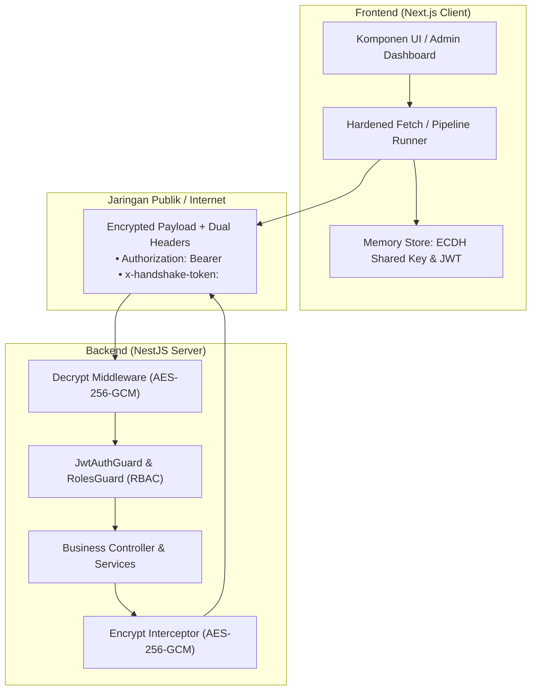
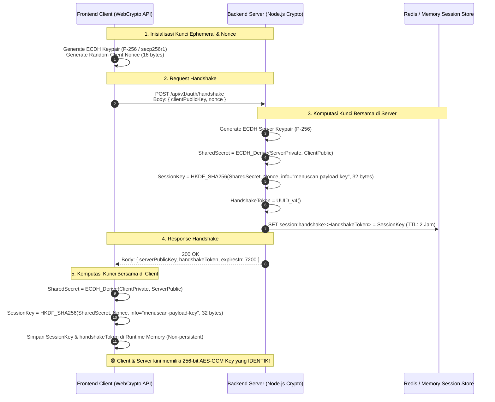
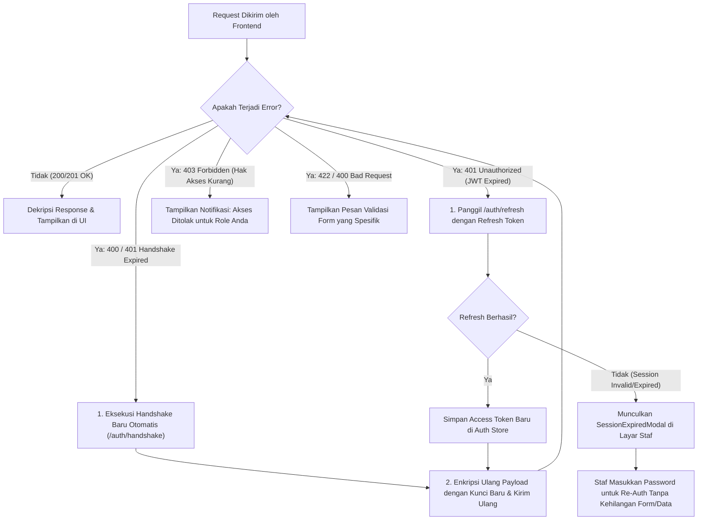
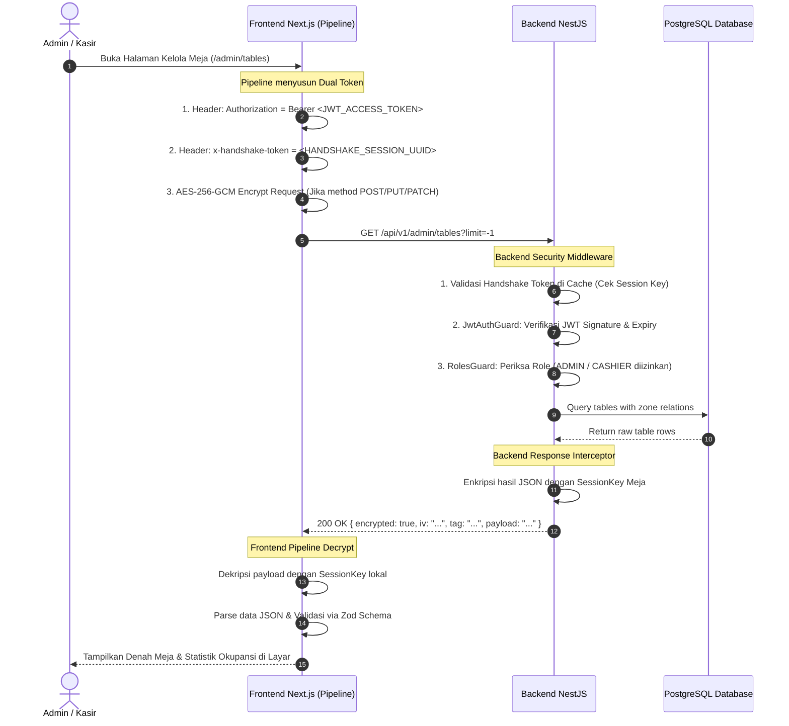

# 🔐 Arsitektur Autentikasi, ECDH Handshake, & Dual-Token Pipeline

> **Dokumen Arsitektur & Alur Logika Bisnis**  
> **Sistem**: MenuScan Digital Ordering Platform  
> **Lingkup**: Frontend (Next.js 15) & Backend (NestJS 11 + Prisma ORM + Redis)  
> **Model Keamanan**: Zero-Trust End-to-End Application-Layer Encryption & Role-Based Access Control (RBAC)

---

## 📑 Daftar Isi
1. [Ringkasan Eksekutif & Konsep Dasar](#1-ringkasan-eksekutif--konsep-dasar)
2. [Arsitektur Dual-Token (*Kedua Token & Fungsinya*)](#2-arsitektur-dual-token-kedua-token--fungsinya)
3. [Alur Kriptografi ECDH Handshake & Penurunan Kunci (*Key Derivation*)](#3-alur-kriptografi-ecdh-handshake--penurunan-kunci-key-derivation)
4. [Alur Bisnis Autentikasi Staf & Sesi Meja Pelanggan](#4-alur-bisnis-autentikasi-staf--sesi-meja-pelanggan)
5. [Siklus Hidup Request / Response Terenkripsi (*Pipeline Architecture*)](#5-siklus-hidup-request--response-terenkripsi-pipeline-architecture)
6. [Mekanisme Pemulihan Otomatis & Error Handling (*Self-Healing*)](#6-mekanisme-pemulihan-otomatis--error-handling-self-healing)
7. [Diagram Alur Lengkap (*Sequence Diagrams*)](#7-diagram-alur-lengkap-sequence-diagrams)

---

## 1. Ringkasan Eksekutif & Konsep Dasar

Sistem **MenuScan** menerapkan strategi keamanan berlapis (*Defense-in-Depth*) untuk melindungi seluruh transaksi kafe, data pesanan, dan hak akses staf dari berbagai ancaman siber seperti:
- **Man-In-The-Middle (MITM) & Proxy Inspection**: Data payload dienkripsi di level aplikasi sebelum masuk ke transport layer (HTTP/HTTPS).
- **Payload Tampering / Request Forgery**: Integritas data diverifikasi menggunakan *Authentication Tag* (AES-256-GCM).
- **Replay Attacks**: Setiap sesi enkripsi memiliki nonce, token sesi unik, dan initialization vector (IV) baru pada tiap payload.
- **Unauthorized Privilege Escalation**: Akses endpoint dibatasi ketat melalui JWT berbasis RBAC (*Admin, Cashier, Kitchen, Waiter*).



---

## 2. Arsitektur Dual-Token (*Kedua Token & Fungsinya*)

Sistem ini memisahkan secara tegas antara **Lapisan Kriptografi (Payload Security)** dan **Lapisan Identitas Bisnis (Identity & Authorization)** melalui dua token independen:

| Parameter | Token 1: Handshake Session Token (`x-handshake-token`) | Token 2: JWT Access Token (`Authorization: Bearer`) |
| :--- | :--- | :--- |
| **Tujuan Utama** | Mengidentifikasi sesi enkripsi simetris (AES-256-GCM Key). | Mengidentifikasi identitas staf & hak akses role (RBAC). |
| **Lokasi Header** | `x-handshake-token: <uuid>` | `Authorization: Bearer <jwt-token>` |
| **Masa Berlaku (TTL)** | 2 Jam (Dapat di-renew otomatis via handshake). | 15 Menit (Access Token) & 7 Hari (Refresh Token). |
| **Payload / Isi** | Session ID acak (UUID v4) yang memetakan ke kunci di server. | Signed Claims: `{ sub, email, role, iat, exp }`. |
| **Penyimpanan Server**| Redis Cache / In-Memory Session Store (`SessionKey`). | Stateless (Divalidasi menggunakan Public/Secret JWT Key). |
| **Target Pengguna** | Semua request client (baik publik pelanggan maupun staf admin).| Khusus endpoint internal staf kafe (*Admin, Kasir, Dapur, Waiter*). |

### Mengapa Harus Menggunakan Dual-Token?
1. **Pemisahan Tanggung Jawab (*Separation of Concerns*)**:
   - Jika JWT dicuri, pelaku tetap tidak bisa membaca/mengubah body payload tanpa memiliki *Session Key* ECDH yang tersimpan di memori client.
   - Sesi enkripsi bisa aktif untuk pelanggan anonim (yang memesan via QR meja) tanpa perlu membuat akun/JWT login.
2. **Kinerja & Skalabilitas**:
   - Server tidak perlu melakukan operasi asimetris (ECDH) pada setiap HTTP request; komputasi berat hanya terjadi 1 kali saat handshake, selanjutnya menggunakan enkripsi simetris cepat (AES-GCM).

---

## 3. Alur Kriptografi ECDH Handshake & Penurunan Kunci

Handshake dilakukan secara transparan oleh *Pipeline Middleware* di frontend sebelum request bisnis pertama dikirim.



---

## 4. Alur Bisnis Autentikasi Staf & Sesi Meja Pelanggan

### A. Autentikasi Staf Kafe (Admin / Cashier / Kitchen / Waiter)
1. **Login (`POST /api/v1/auth/login`)**:
   - Frontend mengenkripsi data login (`{ email, password }`) menggunakan `SessionKey` dan mengirim header `x-handshake-token`.
   - Backend mendekripsi payload, memverifikasi hash password (Bcrypt).
   - Backend menerbitkan **Access Token (JWT)** berumur 15 menit dan **Refresh Token (JWT)** berumur 7 hari.
   - Access Token disimpan di memory store frontend (Zustand Auth Store), sedangkan Refresh Token disimpan di secure storage / HTTP-only cookie.
2. **Role-Based Access Control (RBAC)**:
   - Setiap request ke endpoint `/admin/*` membawa header `Authorization: Bearer <accessToken>`.
   - `JwtAuthGuard` memvalidasi tanda tangan token.
   - `RolesGuard` memeriksa apakah `user.role` cocok dengan metadata `@Roles(Role.ADMIN, Role.CASHIER, ...)`.

### B. Inisialisasi Sesi Meja Pelanggan (QR Scan)
1. **Scan QR (`GET /tables/Meja 01/status`)**:
   - Pelanggan memindai QR fisik di meja kafe yang mengarahkan ke web app.
2. **Klaim Meja / Buka Sesi (`POST /tables/Meja 01/session`)**:
   - Pelanggan memasukkan nama tamu (misal: "Budi").
   - Backend mengubah status meja dari `VACANT` $
ightarrow$ `OCCUPIED`.
   - Pelanggan dapat membuat pesanan yang langsung terikat dengan nomor meja dan zona area meja tersebut.

---

## 5. Siklus Hidup Request / Response Terenkripsi (*Pipeline Architecture*)

Seluruh request API di frontend dieksekusi melalui **Middleware Pipeline Runner** yang modular:

```
Request UI
   │
   ▼
[1. Logger Middleware]     ──> Mencatat timestamp & metrics performa
   │
   ▼
[2. Auth Middleware]       ──> Menyisipkan 'Authorization: Bearer <token>'
   │
   ▼
[3. Handshake Middleware]  ──> Memastikan handshake aktif & menyisipkan 'x-handshake-token'
   │
   ▼
[4. Encryption Middleware] ──> AES-256-GCM Encrypt request body (menghasilkan ciphertext, iv, tag)
   │
   ▼
[5. Fetch Terminal]        ──> Mengirim HTTP Request ke Backend
   │
   ▼ (Jaringan Internet)
   │
[Backend Decrypt MW]       ──> Ambil SessionKey via x-handshake-token, dekripsi req.body
   │
[Backend Auth & RBAC]      ──> Verifikasi JWT & Role
   │
[Backend Controller]       ──> Eksekusi logika bisnis & query database
   │
[Backend Encrypt Interceptor] ──> Enkripsi output data menggunakan SessionKey
   │
   ▼ (Response Network)
   │
[4. Encryption Middleware] ──> AES-256-GCM Decrypt response body
   │
   ▼
[1. Logger Middleware]     ──> Log durasi request & status code
   │
   ▼
Hasil Dikembalikan ke React Query / Zustand UI
```

---

## 6. Mekanisme Pemulihan Otomatis & Error Handling (*Self-Healing*)

Sistem dirancang dengan kemampuan *Self-Healing* transparan tanpa mengganggu pengalaman pengguna:



### Skenario Ketahanan Sistem (*Resilience Scenarios*):
1. **Skenario A: Masa Berlaku Handshake Habis (Kunci Kedaluwarsa)**:
   - Jika backend mengembalikan error token handshake tidak ditemukan/kadaluarsa, `handshakeMiddleware` secara otomatis melakukan *handshake ulang*, memperbarui *Session Key*, mengenkripsi ulang request yang tertunda, dan mengirimkannya kembali tanpa disadari pengguna.
2. **Skenario B: Access Token JWT Habis Saat Digunakan**:
   - `authMiddleware` mendeteksi status `401 Unauthorized`, memicu request `POST /api/v1/auth/refresh` secara otomatis (dengan mekanisme *Mutex Lock* agar tidak terjadi *refresh storm* jika banyak query berjalan bersamaan).
3. **Skenario C: Sesi Login Kedaluwarsa Total**:
   - Jika refresh token juga sudah kadaluarsa (misal setelah 7 hari tidak aktif), sistem menampilkan SessionExpiredModal. Staf cukup memasukkan password kembali untuk memperbarui sesi tanpa kehilangan halaman kerja atau formulir yang sedang diisi.

---

## 7. Diagram Alur Lengkap (*Sequence Diagrams*)

### A. Alur Lengkap Transaksi Request Terenkripsi + Dual Token



---

## 8. Ringkasan File & Modul Implementasi

### Frontend (`fe-menu-scan-latihan`)
- `src/lib/crypto/ecdh.ts`: Generator pasangan kunci WebCrypto P-256 & fungsi HKDF SHA-256.
- `src/lib/api/pipeline/handshake-middleware.ts`: Otomasi handshake sesi & pemulihan re-keying.
- `src/lib/api/pipeline/encryption-middleware.ts`: AES-256-GCM Encrypt/Decrypt request & response.
- `src/lib/api/pipeline/auth-middleware.ts`: Injector JWT Bearer token & refresh token handler.
- `src/lib/api/pipeline/pipeline-runner.ts`: Orkestrator eksekusi pipeline middleware.

### Backend (`be-menu-scan-latihan`)
- `src/modules/auth/handshake.controller.ts` & `handshake.service.ts`: Endpoint pertukaran kunci publik ECDH & manajemen session store.
- `src/common/middleware/decrypt.middleware.ts`: Dekripsi otomatis body request sebelum masuk controller.
- `src/common/interceptors/encrypt.interceptor.ts`: Enkripsi otomatis payload response sebelum dikirim ke client.
- `src/common/guards/jwt-auth.guard.ts` & `roles.guard.ts`: Penegak RBAC dan otentikasi identitas staf.
