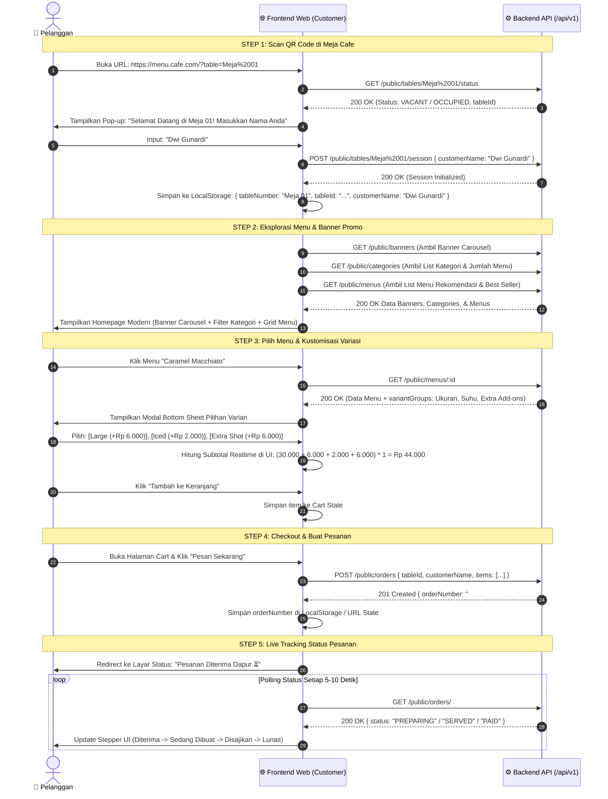
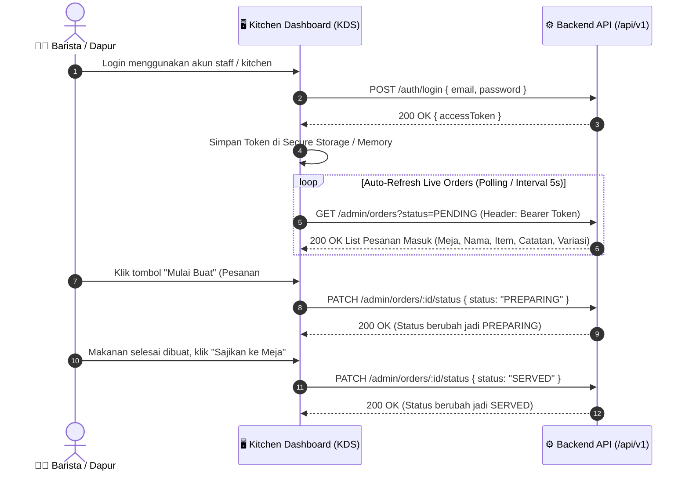
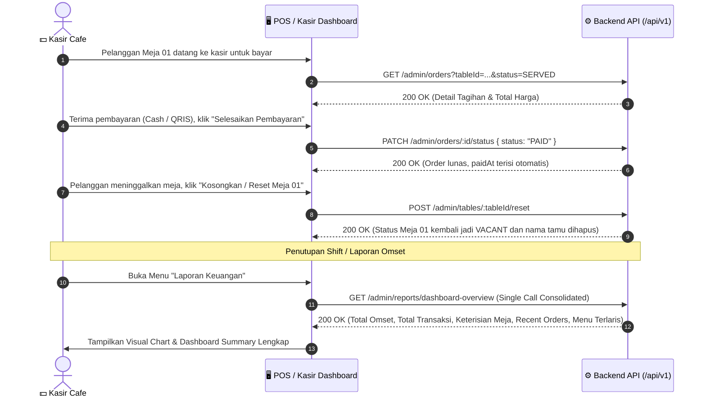
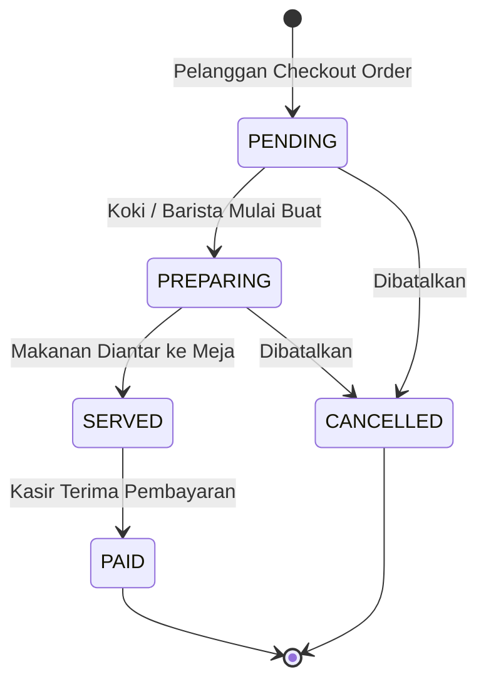

# 📱 MenuScan – Master Frontend Integration & Application Architecture Guide

> **Target Audience**: Frontend Engineers (React, Next.js, Vue, Flutter, Web / PWA), UI/UX Designers, Product Managers  
> **Backend Architecture**: NestJS 11 + PostgreSQL + Prisma ORM + ECDH / AES-256-GCM + JWT Auth  
> **API Base URL**: `http://localhost:5000/api/v1`  
> **Interactive Swagger OpenAPI**: `http://localhost:5000/api/docs`  
> **Status**: **Production Ready & Complete (Phases 0–4 Verified)**

---

## 📑 Daftar Isi
1. [Executive Summary & System Vision](#1-executive-summary--system-vision)
2. [Arsitektur Aplikasi & Peran Pengguna (User Roles)](#2-arsitektur-aplikasi--peran-pengguna-user-roles)
3. [Alur Bisnis & User Journey (End-to-End)](#3-alur-bisnis--user-journey-end-to-end)
   - [A. Customer Journey (Scan Meja $\rightarrow$ Tracking Pesanan)](#a-customer-journey-scan-meja--tracking-pesanan)
   - [B. Kitchen / Barista Journey (Live Order Monitor)](#b-kitchen--barista-journey-live-order-monitor)
   - [C. Cashier / Admin Journey (Payment $\rightarrow$ Reset Meja $\rightarrow$ Laporan)](#c-cashier--admin-journey-payment--reset-meja--laporan)
4. [Pemetaan Layar Frontend (Screen-by-Screen UI Blueprints)](#4-pemetaan-layar-frontend-screen-by-screen-ui-blueprints)
   - [A. Customer Mobile Web App (Screens 1 – 5)](#a-customer-mobile-web-app-screens-1--5)
   - [B. Proper Admin & Staff Dashboard Suite (Screens A – E)](#b-proper-admin--staff-dashboard-suite-screens-a--e)
5. [Spesifikasi Teknis Integrasi API](#5-spesifikasi-teknis-integrasi-api)
   - [A. Standard Envelope Response Format](#a-standard-envelope-response-format)
   - [B. Logika Perhitungan Harga Varian di Frontend (Cart Formula)](#b-logika-perhitungan-harga-varian-di-frontend-cart-formula)
   - [C. State Machine Siklus Hidup Pesanan (Order Status Flow)](#c-state-machine-siklus-hidup-pesanan-order-status-flow)
   - [D. Alur Enkripsi Payload (ECDH Handshake)](#d-alur-enkripsi-payload-ecdh-handshake)
6. [Katalog Endpoint & Contoh Payload Lengkap](#6-katalog-endpoint--contoh-payload-lengkap)
   - [1. Modul Public (Customer)](#1-modul-public-customer)
   - [2. Modul Auth (Admin)](#2-modul-auth-admin)
   - [3. Modul Admin Operations, Floor Plan & KDS](#3-modul-admin-operations-floor-plan--kds)
   - [4. Modul Admin Dashboard Overview & Analytics Reports](#4-modul-admin-dashboard-overview--analytics-reports)

---

## 1. Executive Summary & System Vision

**MenuScan** adalah sistem pemesanan cafe & restoran digital berbasis QR Code tanpa perlu download aplikasi (Web-based PWA / Responsive Web).  
Sistem ini dirancang untuk memisahkan 2 pengalaman pengguna:
1. **Customer Mobile Experience (Smartphone / Mobile-First)**:
   - Pelanggan duduk di meja, scan QR code di meja.
   - Mengisi nama pemesan, melihat banner promo dan kategori menu.
   - Memilih menu dengan modifikasi varian (ukuran, suhu, level pedas, extra topping).
   - Melakukan checkout pesanan ke dapur secara instan dan memantau status pembuatan (*Live Order Tracking*).
2. **Proper Admin & Operations Dashboard (Desktop / iPad / Tablet)**:
   - **Executive Dashboard**: KPI metrik omset hari ini, keterisian meja, pesanan aktif, grafik penjualan.
   - **Kitchen Display System (KDS)**: Papan Kanban live order untuk koki dapur & barista (*Pending* $\rightarrow$ *Preparing* $\rightarrow$ *Served*).
   - **Interactive Visual Floor Plan (Peta Meja)**: Grid denah visual meja dengan indikator warna status meja dan tombol cepat penagihan kasir.
   - **Menu & Modifier Catalog Manager**: Pengaturan menu, reorder kategori, dan fast toggle ketersediaan stok (*Out of Stock*).
   - **Financial Analytics & Reports**: Laporan omset kotor, AOV (*Average Order Value*), dan item terlaris.

---

## 2. Arsitektur Aplikasi & Peran Pengguna (User Roles)

```mermaid
graph TD
    subgraph "Customer Layer (Public / Tanpa Login)"
        Customer["📱 Pelanggan di Meja Cafe"]
        QR["📷 Scan QR Code Meja"]
        Customer --> QR
        QR --> ScreenTable["Layar 1: Validasi Meja & Masukkan Nama"]
        ScreenTable --> ScreenHome["Layar 2: Home (Banner, Kategori, Menu)"]
        ScreenHome --> ScreenDetail["Layar 3: Detail Menu & Pilih Variasi"]
        ScreenDetail --> ScreenCart["Layar 4: Keranjang & Checkout"]
        ScreenCart --> ScreenStatus["Layar 5: Live Tracking Pesanan"]
    end

    subgraph "Backend API (NestJS + PostgreSQL)"
        API["⚙️ MenuScan API (/api/v1)"]
        DB[("🗄️ PostgreSQL Database")]
        API <--> DB
    end

    subgraph "Admin & Staff Dashboard Layer (JWT Bearer Auth)"
        Admin["💻 Kasir / Barista / Manager"]
        AdminLogin["Layar 0: Login Admin"]
        ScreenA["Layar A: Executive Overview Dashboard"]
        ScreenB["Layar B: Kitchen Display System (KDS Kanban)"]
        ScreenC["Layar C: Interactive Floor Plan (Peta Meja)"]
        ScreenD["Layar D: Menu & Modifier Manager"]
        ScreenE["Layar E: Financial & Sales Analytics"]
        
        Admin --> AdminLogin
        AdminLogin --> ScreenA
        AdminLogin --> ScreenB
        AdminLogin --> ScreenC
        AdminLogin --> ScreenD
        AdminLogin --> ScreenE
    end

    ScreenTable -->|1. Cek Meja & Set Nama| API
    ScreenHome -->|2. Get Banners & Menus| API
    ScreenCart -->|3. Kirim Pesanan (Order)| API
    ScreenStatus -->|4. Polling Status Pesanan| API

    AdminLogin -->|Login JWT| API
    ScreenA -->|Get Consolidated Dashboard Overview| API
    ScreenB -->|Live Orders & Update Status| API
    ScreenC -->|Table Map & Reset Sesi| API
    ScreenD -->|CRUD Menu & Fast Toggle Stok| API
    ScreenE -->|Tarik Laporan Omset & Top Selling| API
```

---

## 3. Alur Bisnis & User Journey (End-to-End)

### A. Customer Journey (Scan Meja $\rightarrow$ Tracking Pesanan)



---

### B. Kitchen / Barista Journey (Live Order Monitor)



---

### C. Cashier / Admin Journey (Payment $\rightarrow$ Reset Meja $\rightarrow$ Laporan)



---

## 4. Pemetaan Layar Frontend (Screen-by-Screen UI Blueprints)

### A. Customer Mobile Web App (Screens 1 – 5)

```
┌────────────────────────────────────────────────────────────────────────────────────────┐
│                                CUSTOMER MOBILE WEB APP                                 │
├──────────────────────────┬──────────────────────────┬──────────────────────────────────┤
│ Screen 1: Scan & Nama    │ Screen 2: Catalog Home   │ Screen 3: Detail Menu & Varian   │
├──────────────────────────┼──────────────────────────┼──────────────────────────────────┤
│                          │ 🏷️ [Banner Carousel]    │ 🖼️ [Gambar Menu Besar]          │
│ 🍽️ Cafe Logo            │                          │ ☕ Caramel Macchiato             │
│                          │ 🔘 [All][Kopi][Snack]... │ 💵 Rp 30.000 (Promo)             │
│ 📍 Meja Terdeteksi:      │                          │ 📝 Espresso + Vanilla + Milk     │
│   "Meja 01"              │ 🔍 [Cari Menu...]        │                                  │
│                          │                          │ 🔘 Pilih Ukuran (Wajib):         │
│ 👤 Nama Anda:            │ ┌──────────────────────┐ │    (o) Regular (Rp 0)            │
│ [ Dwi Gunardi          ] │ │ ☕ Caramel Macchiato │ │    ( ) Large (+Rp 6.000)         │
│                          │ │ Rp 30.000  [+ Tambah]│ │ 🔘 Suhu (Wajib):                 │
│ [ 🚀 Mulai Pesan Menu ]  │ └──────────────────────┘ │    (o) Hot  ( ) Iced (+Rp 2.000) │
│                          │ 🛒 [Keranjang: 2 Items]  │ [ + Masukkan Keranjang (36k) ]   │
├──────────────────────────┴──────────────────────────┴──────────────────────────────────┤
│ Screen 4: Cart / Keranjang Review                   │ Screen 5: Live Order Tracking    │
├─────────────────────────────────────────────────────┼──────────────────────────────────┤
│ 🛒 Keranjang Pesanan (Meja 01 - Dwi Gunardi)        │ 🧾 Status Pesanan #ORD-202608-01 │
│ ─────────────────────────────────────────────────── │ 📍 Meja 01 (Dwi Gunardi)         │
│ 1x Caramel Macchiato (Large, Iced)       Rp 38.000  │                                  │
│    Catatan: Less Sweet                              │ 🟢 1. Pesanan Diterima (10:15)   │
│ 1x Nasi Goreng Spesial (Pedas Lv 2)      Rp 42.000  │ 🟡 2. Sedang Dimasak   (10:18)   │
│ ─────────────────────────────────────────────────── │ ⚪ 3. Siap Disajikan             │
│ Subtotal:                                Rp 80.000  │ ⚪ 4. Selesai / Lunas            │
│ Pajak/Service:                           Rp      0  │                                  │
│ Total Bayar:                             Rp 80.000  │ 💡 Mohon tunggu di meja Anda     │
│ [ ⚡ Konfirmasi & Pesan Sekarang ]                  │ [ 🔄 Refresh Status ]            │
└─────────────────────────────────────────────────────┴──────────────────────────────────┘
```

---

### B. Proper Admin & Staff Dashboard Suite (Screens A – E)

Berikut adalah cetak biru 5 Layar Dashboard Admin untuk Tim Frontend:

#### 📊 Layar A: Executive Overview Dashboard
*Endpoint Utama: `GET /api/v1/admin/reports/dashboard-overview`*

```
┌────────────────────────────────────────────────────────────────────────────────────────────────────────┐
│ 🍽️ MENUSCAN ADMIN PANEL  │ 🔍 Search...                      [🔔 3 Orders]  [👤 Admin MenuScan ▼]    │
├──────────────────────────┼─────────────────────────────────────────────────────────────────────────────┤
│ [📊 Overview Dashboard] │ 📈 RINGKASAN HARI INI (TODAY'S KPI)                                         │
│ [🍳 Kitchen KDS Board]   │ ┌────────────────┐ ┌────────────────┐ ┌────────────────┐ ┌────────────────┐  │
│ [📍 Floor Plan (Meja)]   │ │ 💵 OMSET HARI INI│ │ ⏳ ACTIVE ORDERS │ │ 🪑 KETERISIAN MEJA│ │ ✅ ORDER SELESAI│  │
│ [🍽️ Kelola Menu]        │ │ Rp 2.450.000   │ │ 4 Pesanan Masuk│ │ 7/10 Meja (70%)│ │ 48 Transaksi   │  │
│ [🏷️ Banner Promo]        │ └────────────────┘ └────────────────┘ └────────────────┘ └────────────────┘  │
│ [📈 Laporan Omset]       │                                                                             │
│ [⚙️ Pengaturan]          │ ┌──────────────────────────────────────────┐ ┌────────────────────────────┐  │
│                          │ │ 🕒 LIVE RECENT ORDERS                    │ │ 🏆 TOP SELLING TODAY     │  │
│                          │ │ #ORD-001 | Meja 01 | Rp 76.000 | PENDING │ │ 1. Caramel Macchiato(28) │  │
│                          │ │ #ORD-002 | Meja 04 | Rp 42.000 | PREPARING│ │ 2. Nasi Goreng Cafe (21) │  │
│                          │ │ #ORD-003 | Meja 02 | Rp 28.000 | SERVED  │ │ 3. Matcha Oat Latte (18) │  │
│                          │ └──────────────────────────────────────────┘ └────────────────────────────┘  │
└──────────────────────────┴─────────────────────────────────────────────────────────────────────────────┘
```

---

#### 🍳 Layar B: Kitchen Display System (KDS Kanban Board)
*Endpoint Utama: `GET /api/v1/admin/orders?status=...` & `PATCH /api/v1/admin/orders/:id/status`*

```
┌────────────────────────────────────────────────────────────────────────────────────────────────────────┐
│ 🍳 KITCHEN DISPLAY SYSTEM (KDS)                     [Filter: Semua] [☕ Barista Only] [🍳 Dapur Only]   │
├───────────────────────────────────┬───────────────────────────────────┬────────────────────────────────┤
│ 🟡 PESANAN BARU (PENDING - 2)     │ 🔵 SEDANG DIMASAK (PREPARING - 2) │ 🟢 SIAP SAJI (SERVED - 1)      │
├───────────────────────────────────┼───────────────────────────────────┼────────────────────────────────┤
│ ┌───────────────────────────────┐ │ ┌───────────────────────────────┐ │ ┌────────────────────────────┐ │
│ │ 🧾 #ORD-001 • Meja 01 (Dwi G) │ │ │ 🧾 #ORD-003 • Meja 04 (Siti)  │ │ │ 🧾 #ORD-002 • Meja 02 (Budi)│ │
│ │ ⏱️ Masuk: 2 Menit lalu        │ │ │ ⏱️ Sedang dibuat: 6 Menit    │ │ │ ⏱️ Disajikan: 10:20 WIB    │ │
│ │ ───────────────────────────── │ │ │ ───────────────────────────── │ │ ────────────────────────── │ │
│ │ • 2x Caramel Macchiato        │ │ │ • 1x Nasi Goreng Spesial      │ │ │ • 1x Americano Hot (Large) │ │
│ │   - Large, Iced, Extra Shot   │ │ │   - Level 2, Telur Dadar      │ │ │ • 1x Croissant Butter      │ │
│ │   📝 "Less sweet"             │ │ │ • 1x Matcha Oat Latte (Ice)   │ │ └────────────────────────────┘ │
│ │ ───────────────────────────── │ │ └───────────────────────────────┘ │ [ Status: Di Meja Pelanggan ]  │
│ │ [ ▶️ MULAI MASAK / BUAT ]     │ │ [ ✅ SELESAI / SIAP DISAJIKAN ]  │                                │
│ └───────────────────────────────┘ │                                   │                                │
└───────────────────────────────────┴───────────────────────────────────┴────────────────────────────────┘
```

---

#### 📍 Layar C: Interactive Floor Plan & Visual Table Grid
*Endpoint Utama: `GET /api/v1/admin/tables` & `POST /api/v1/admin/tables/:id/reset`*

```
┌────────────────────────────────────────────────────────────────────────────────────────────────────────┐
│ 📍 PETA MEJA & STATUS KETERISIAN (FLOOR PLAN)                [+ Tambah Meja] [🔄 Refresh Floor Plan]   │
├────────────────────────────────────────────────────────────────────────────────────────────────────────┤
│ 🟢 VACANT (Kosong) : 3 Meja    │ 🟡 OCCUPIED (Sedang Makan) : 6 Meja    │ 🔴 WAITING PAYMENT : 1 Meja  │
├────────────────────────────────────────────────────────────────────────────────────────────────────────┤
│ ┌───────────────┐ ┌───────────────┐ ┌───────────────┐ ┌───────────────┐ ┌───────────────┐              │
│ │    MEJA 01    │ │    MEJA 02    │ │    MEJA 03    │ │    MEJA 04    │ │    MEJA 05    │              │
│ │  🟡 OCCUPIED  │ │  🟢 VACANT    │ │  🔴 WAIT BILL │ │  🟡 OCCUPIED  │ │  🟢 VACANT    │              │
│ │ 👤 Dwi Gunardi│ │ 👤 -          │ │ 👤 Andi       │ │ 👤 Siti       │ │ 👤 -          │              │
│ │ 🧾 Rp 76.000  │ │ 🧾 Rp 0       │ │ 🧾 Rp 120.000 │ │ 🧾 Rp 42.000  │ │ 🧾 Rp 0       │              │
│ │ [Detail Tagihan]│ [Print QR Meja]│ [💵 Proses Bayar]│ [Detail Tagihan]│ [Print QR Meja]│              │
│ └───────────────┘ └───────────────┘ └───────────────┘ └───────────────┘ └───────────────┘              │
│                                                                                                        │
│ 💡 Slide-over Drawer saat klik [Detail Tagihan]:                                                      │
│    • Daftar Item Pesanan & Snapshot Varian                                                             │
│    • Total Tagihan Meja                                                                                │
│    • Tombol: [💵 Lunaskan Tagihan (Status: PAID)] & [🧹 Kosongkan Meja (Reset Table ke VACANT)]        │
└────────────────────────────────────────────────────────────────────────────────────────────────────────┘
```

---

#### 🍽️ Layar D: Menu & Modifier Manager
*Endpoint Utama: `GET /api/v1/admin/menus`, `POST /api/v1/admin/menus`, `PATCH /api/v1/admin/menus/:id/status`*

```
┌────────────────────────────────────────────────────────────────────────────────────────────────────────┐
│ 🍽️ KATALOG MENU & VARIAN MODIFIER                            [+ Kategori Baru]  [+ Tambah Menu Baru]  │
├────────────────────────────────────────────────────────────────────────────────────────────────────────┤
│ 📂 TAB KATEGORI: [All (12)] [☕ Coffee (4)] [🍵 Non-Coffee (3)] [🍛 Local (3)] [🍟 Snacks (2)]        │
├────────────────────────────────────────────────────────────────────────────────────────────────────────┤
│ 🖼️ Foto │ Nama Menu          │ Kategori │ Harga Normal │ Harga Promo │ Varian Modifier │ Status Stok  │
├─────────┼────────────────────┼──────────┼──────────────┼─────────────┼─────────────────┼──────────────┤
│ [IMG]   │ Caramel Macchiato  │ Coffee   │ Rp 35.000    │ Rp 30.000   │ 3 Grup (Ukuran..)│ [🟢 TERSEDIA]│
│ [IMG]   │ Americano Classic  │ Coffee   │ Rp 25.000    │ -           │ 2 Grup (Suhu..) │ [🟢 TERSEDIA]│
│ [IMG]   │ Truffle Fries      │ Snacks   │ Rp 28.000    │ -           │ 1 Grup (Saus..) │ [🔴 HABIS] ⚡ │
│                                                                             *(1-Click Fast Toggle)*    │
├────────────────────────────────────────────────────────────────────────────────────────────────────────┤
│ 💡 Visual Form Builder saat klik [+ Tambah Menu Baru]:                                                 │
│    • Input Nama, Kategori, Harga, Promo Price, Upload Image URL                                        │
│    • Dynamic Nested Variant Group Builder:                                                             │
│      [+ Tambah Grup Varian] -> Contoh: "Level Pedas" (Wajib: Ya, Min: 1, Max: 1)                       │
│        └─ Opsi: Level 0 (+Rp 0), Level 1 (+Rp 0), Level 2 (+Rp 2.000)                                  │
└────────────────────────────────────────────────────────────────────────────────────────────────────────┘
```

---

#### 📈 Layar E: Financial & Sales Analytics
*Endpoint Utama: `GET /api/v1/admin/reports/revenue` & `GET /api/v1/admin/reports/top-selling`*

```
┌────────────────────────────────────────────────────────────────────────────────────────────────────────┐
│ 📈 LAPORAN PENDAPATAN & PENJUALAN                  📅 [01/08/2026] s/d [10/08/2026]  [📥 Export CSV]   │
├────────────────────────────────────────────────────────────────────────────────────────────────────────┤
│ ┌────────────────────────┐ ┌────────────────────────┐ ┌────────────────────────┐                      │
│ │ 💰 TOTAL PENDAPATAN    │ │ 📦 TOTAL TRANSAKSI     │ │ 📊 AVERAGE ORDER VALUE │                      │
│ │ Rp 14.850.000          │ │ 340 Pesanan Selesai    │ │ Rp 43.676 / Pesanan    │                      │
│ └────────────────────────┘ └────────────────────────┘ └────────────────────────┘                      │
│                                                                                                        │
│ 🏆 MENU PALING LARIS (TOP-SELLING PRODUCTS)                                                            │
│ 1. Caramel Macchiato        • 142 Porsi Terjual    • Kontribusi Omset: Rp 4.260.000 (28.6%)            │
│ 2. Nasi Goreng Spesial Cafe • 110 Porsi Terjual    • Kontribusi Omset: Rp 4.620.000 (31.1%)            │
│ 3. Matcha Oat Latte         •  88 Porsi Terjual    • Kontribusi Omset: Rp 2.992.000 (20.1%)            │
│ 4. Truffle French Fries     •  75 Porsi Terjual    • Kontribusi Omset: Rp 2.100.000 (14.1%)            │
└────────────────────────────────────────────────────────────────────────────────────────────────────────┘
```

---

## 5. Spesifikasi Teknis Integrasi API

### A. Standard Envelope Response Format

Seluruh endpoint backend mengembalikan respon seragam:

```json
{
  "success": true,
  "statusCode": 200,
  "data": { ... }
}
```

Format error standar:
```json
{
  "success": false,
  "statusCode": 400,
  "error": "Bad Request",
  "message": "Category not found or deleted",
  "timestamp": "2026-08-10T10:15:30.123Z",
  "path": "/api/v1/public/orders"
}
```

---

### B. Logika Perhitungan Harga Varian di Frontend (Cart Formula)

$$\text{Item Unit Price} = \text{Effective Menu Price} + \sum (\text{Extra Price of Selected Options})$$

$$\text{Item Subtotal} = \text{Item Unit Price} \times \text{Quantity}$$

> [!TIP]
> **Effective Menu Price**: Jika `menu.promoPrice` tidak `null`, gunakan `menu.promoPrice`. Jika `null`, gunakan `menu.price`.

---

### C. State Machine Siklus Hidup Pesanan (Order Status Flow)



---

### D. Alur Enkripsi Payload (ECDH Handshake)

1. **Untuk Admin Dashboard**: Menggunakan **JWT Bearer Token** standar pada header:
   ```http
   Authorization: Bearer <jwt_access_token>
   ```
2. **Untuk Customer Client (Jika ingin mengaktifkan Payload Encryption)**:
   - Handshake awal via `POST /api/v1/auth/handshake` $\rightarrow$ Simpan `serverPublicKey` & `x-handshake-token`.
   - Kirim header `x-handshake-token: <token>` dengan body envelope AES-256-GCM (`{ encrypted: true, iv, tag, payload }`).
   - *Catatan: Permintaan plain JSON tetap didukung.*

---

## 6. Katalog Endpoint & Contoh Payload Lengkap

### 1. Modul Public (Customer)

#### 1.1. Cek Status Meja & Mulai Sesi
- **Endpoint**: `GET /api/v1/public/tables/:number/status`
- **Inisialisasi Sesi**: `POST /api/v1/public/tables/:number/session`
  ```json
  {
    "customerName": "Dwi Gunardi"
  }
  ```

#### 1.2. Banner Promo & Kategori Menu
- **Ambil Banners**: `GET /api/v1/public/banners`
- **Ambil Kategori**: `GET /api/v1/public/categories`
- **Ambil Katalog Menu**: `GET /api/v1/public/menus?categoryId=...&search=latte&isBestSeller=true`
- **Ambil Detail Menu & Varian**: `GET /api/v1/public/menus/:id`

#### 1.3. Buat Pesanan Baru (Checkout)
- **Endpoint**: `POST /api/v1/public/orders`
- **Request Body**:
  ```json
  {
    "tableId": "b1b0cb7e-7c5e-473d-8158-b80c2f342f0b",
    "customerName": "Dwi Gunardi",
    "items": [
      {
        "menuItemId": "menu-uuid-123",
        "quantity": 2,
        "notes": "Less sweet dan es dipisah",
        "selectedVariants": [
          {
            "groupName": "Pilih Ukuran",
            "optionName": "Large (16 oz)",
            "extraPrice": 6000
          },
          {
            "groupName": "Suhu Penyajian",
            "optionName": "Iced",
            "extraPrice": 2000
          }
        ]
      }
    ]
  }
  ```
- **Live Tracking Pesanan**: `GET /api/v1/public/orders/:orderNumber`

---

### 2. Modul Auth (Admin)

- **Admin Login**: `POST /api/v1/auth/login` (`{ "email": "admin@menuscan.com", "password": "admin123" }`)
- **Profile Check**: `GET /api/v1/auth/me` (Header: `Authorization: Bearer <token>`)
- **Refresh Token**: `POST /api/v1/auth/refresh`
- **Logout**: `POST /api/v1/auth/logout`

---

### 3. Modul Admin Operations, Floor Plan & KDS

*(Wajib Header: `Authorization: Bearer <accessToken>`)*

#### 3.1. Kitchen Live Orders (KDS)
- **List Pesanan Masuk**: `GET /api/v1/admin/orders?status=PENDING&page=1&limit=20`
- **Update Status Pesanan**: `PATCH /api/v1/admin/orders/:id/status` (`{ "status": "PREPARING" | "SERVED" | "PAID" | "CANCELLED" }`)

#### 3.2. Peta Meja & Reset Sesi Meja
- **List Semua Meja**: `GET /api/v1/admin/tables`
- **Tambah Meja**: `POST /api/v1/admin/tables` (`{ "number": "Meja 11" }`)
- **Reset Sesi Meja ke Kosong (VACANT)**: `POST /api/v1/admin/tables/:id/reset`

#### 3.3. Manajemen Katalog Menu & Fast Toggle
- **List Semua Menu Admin**: `GET /api/v1/admin/menus?page=1&limit=20`
- **Tambah Menu Baru dengan Varian**: `POST /api/v1/admin/menus`
- **Fast Toggle Stok Habis**: `PATCH /api/v1/admin/menus/:id/status` (`{ "isAvailable": false }`)
- **Update Detail Menu**: `PATCH /api/v1/admin/menus/:id`
- **Hapus Menu (Soft Delete)**: `DELETE /api/v1/admin/menus/:id`

---

### 4. Modul Admin Dashboard Overview & Analytics Reports

#### 4.1. Single-Call Consolidated Dashboard Overview
- **Endpoint**: `GET /api/v1/admin/reports/dashboard-overview`
- **Header**: `Authorization: Bearer <accessToken>`
- **Response `200 OK`**:
  ```json
  {
    "success": true,
    "statusCode": 200,
    "data": {
      "kpi": {
        "todayRevenue": 2450000,
        "todayOrdersCount": 48,
        "activeOrdersCount": 4,
        "tableOccupancy": {
          "totalTables": 10,
          "occupiedTables": 7,
          "occupancyPercentage": 70
        }
      },
      "recentOrders": [
        {
          "id": "ord-001",
          "orderNumber": "ORD-20260810-001",
          "tableNumber": "Meja 01",
          "customerName": "Dwi Gunardi",
          "status": "PENDING",
          "totalAmount": 76000,
          "itemCount": 2,
          "createdAt": "2026-08-10T10:30:00.000Z"
        }
      ],
      "topSellingToday": [
        {
          "menuItemId": "menu-uuid-1",
          "name": "Caramel Macchiato",
          "quantitySold": 28,
          "revenue": 980000
        },
        {
          "menuItemId": "menu-uuid-4",
          "name": "Nasi Goreng Spesial Cafe",
          "quantitySold": 21,
          "revenue": 882000
        }
      ]
    }
  }
  ```

#### 4.2. Laporan Omset & Top-Selling Kustom
- **Laporan Pendapatan Berdasarkan Tanggal**: `GET /api/v1/admin/reports/revenue?startDate=2026-08-01&endDate=2026-08-10`
- **Top Selling Berdasarkan Periode**: `GET /api/v1/admin/reports/top-selling?limit=10&startDate=2026-08-01&endDate=2026-08-10`
