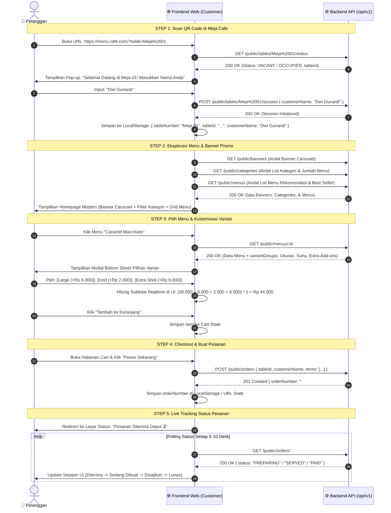
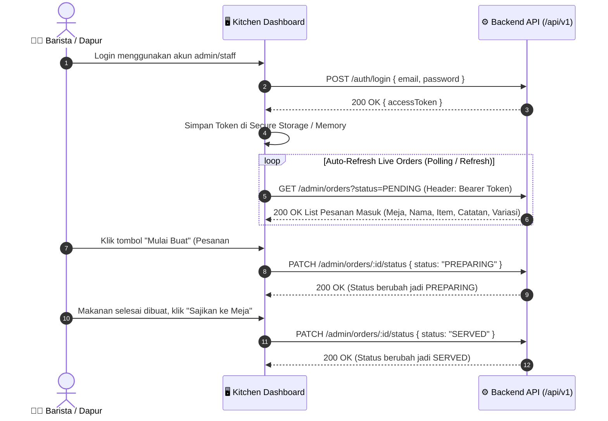
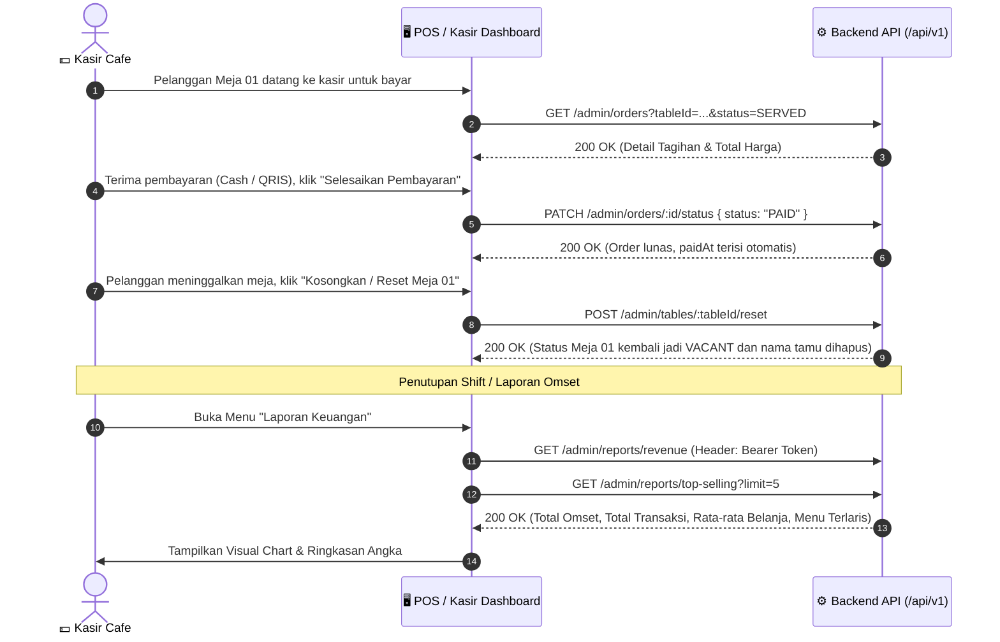
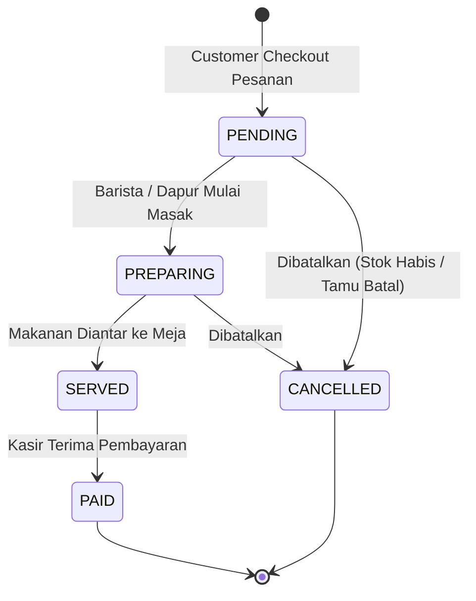

# 📱 MenuScan – Frontend Integration & Application Flow Guide

> **Target Audience**: Frontend Developers (React / Next.js / Vue / Flutter / Mobile / Web), UI/UX Engineers, & Product Team  
> **API Base URL**: `http://localhost:5000/api/v1`  
> **Swagger Interactive Docs**: `http://localhost:5000/api/docs`  
> **Status**: Ready for Implementation & Integration

---

## 📑 Daftar Isi
1. [Executive Summary & Concept](#1-executive-summary--concept)
2. [Arsitektur Aplikasi & Peran Pengguna (User Roles)](#2-arsitektur-aplikasi--peran-pengguna-user-roles)
3. [Alur Bisnis & User Journey (End-to-End)](#3-alur-bisnis--user-journey-end-to-end)
   - [A. Customer Journey (Scan Meja $\rightarrow$ Tracking Pesanan)](#a-customer-journey-scan-meja--tracking-pesanan)
   - [B. Kitchen / Barista Journey (Live Order Monitor)](#b-kitchen--barista-journey-live-order-monitor)
   - [C. Cashier / Admin Journey (Payment $\rightarrow$ Reset Meja $\rightarrow$ Laporan)](#c-cashier--admin-journey-payment--reset-meja--laporan)
4. [Pemetaan Layar Frontend (Screen-by-Screen UI Mapping)](#4-pemetaan-layar-frontend-screen-by-screen-ui-mapping)
5. [Spesifikasi Teknis Integrasi API](#5-spesifikasi-teknis-integrasi-api)
   - [A. Standard Envelope Response](#a-standard-envelope-response)
   - [B. Logika Perhitungan Harga Varian di Frontend (Cart Formula)](#b-logika-perhitungan-harga-varian-di-frontend-cart-formula)
   - [C. State Machine Siklus Hidup Pesanan (Order Status)](#c-state-machine-siklus-hidup-pesanan-order-status)
   - [D. Alur Enkripsi Payload (ECDH Handshake)](#d-alur-enkripsi-payload-ecdh-handshake)
6. [Katalog Endpoint & Contoh Payload Lengkap](#6-katalog-endpoint--contoh-payload-lengkap)
   - [1. Modul Public (Customer)](#1-modul-public-customer)
   - [2. Modul Auth (Admin)](#2-modul-auth-admin)
   - [3. Modul Admin Operations & Reports](#3-modul-admin-operations--reports)

---

## 1. Executive Summary & Concept

**MenuScan** adalah sistem pemesanan menu digital berbasis QR Code tanpa perlu download aplikasi (Web-based PWA / Responsive Web).  
Sistem ini memfasilitasi 2 antarmuka utama:
1. **Customer Web App (Mobile-First / Smartphone View)**: Pelanggan duduk di meja cafe, scan QR meja, melihat menu, memilih variasi pesanan, checkout pesanan, dan memantau status pembuatan makanan secara *real-time*.
2. **Admin & Kitchen Dashboard (Tablet / Desktop View)**: Manajemen dapur/kasir untuk menerima live order, mengubah status makanan (*Preparing* $\rightarrow$ *Served* $\rightarrow$ *Paid*), manajemen katalog menu, dan melihat laporan pendapatan.

---

## 2. Arsitektur Aplikasi & Peran Pengguna (User Roles)

```mermaid
graph TD
    subgraph "Customer Layer (Public / No Auth Required)"
        Customer["📱 Pelanggan di Meja Cafe"]
        QR["📷 Scan QR Code di Meja"]
        Customer --> QR
        QR --> ScreenTable["Layar 1: Validasi Meja & Masukkan Nama"]
        ScreenTable --> ScreenHome["Layar 2: Home (Banner, Kategori, Menu)"]
        ScreenHome --> ScreenDetail["Layar 3: Detail Menu & Pilih Variasi"]
        ScreenDetail --> ScreenCart["Layar 4: Keranjang & Checkout"]
        ScreenCart --> ScreenStatus["Layar 5: Live Tracking Pesanan"]
    end

    subgraph "Backend API (NestJS + PostgreSQL)"
        API["⚙️ MenuScan API (/api/v1)"]
        DB[("🗄️ PostgreSQL Database")]
        API <--> DB
    end

    subgraph "Admin & Staff Layer (JWT Bearer Auth)"
        Admin["💻 Kasir / Barista / Manager"]
        AdminLogin["Layar A: Login Admin"]
        AdminKitchen["Layar B: Live Kitchen Monitor"]
        AdminMenu["Layar C: Kelola Menu & Kategori"]
        AdminReport["Layar D: Laporan Omset & Penjualan"]
        Admin --> AdminLogin
        AdminLogin --> AdminKitchen
        AdminLogin --> AdminMenu
        AdminLogin --> AdminReport
    end

    ScreenTable -->|1. Cek Meja & Set Nama| API
    ScreenHome -->|2. Get Banners & Menus| API
    ScreenCart -->|3. Kirim Pesanan (Order)| API
    ScreenStatus -->|4. Polling Status Pesanan| API

    AdminLogin -->|Login JWT| API
    AdminKitchen -->|Live Orders & Update Status| API
    AdminMenu -->|CRUD Menu & Fast Toggle| API
    AdminReport -->|Tarik Laporan Omset| API
```

---

## 3. Alur Bisnis & User Journey (End-to-End)

### A. Customer Journey (Scan Meja $\rightarrow$ Tracking Pesanan)



---

### B. Kitchen / Barista Journey (Live Order Monitor)



---

### C. Cashier / Admin Journey (Payment $\rightarrow$ Reset Meja $\rightarrow$ Laporan)



---

## 4. Pemetaan Layar Frontend (Screen-by-Screen UI Mapping)

Untuk memudahkan developer FE membuat halaman tanpa desain Figma/web:

```
┌────────────────────────────────────────────────────────────────────────────────────────┐
│                                CUSTOMER MOBILE WEB APP                                 │
├──────────────────────────┬──────────────────────────┬──────────────────────────────────┤
│ Screen 1: Scan & Nama    │ Screen 2: Catalog Home   │ Screen 3: Detail Menu & Varian   │
├──────────────────────────┼──────────────────────────┼──────────────────────────────────┤
│                          │ 🏷️ [Banner Carousel]    │ 🖼️ [Gambar Menu Besar]          │
│ 🍽️ Cafe Logo            │                          │ ☕ Caramel Macchiato             │
│                          │ 🔘 [All][Kopi][Snack]... │ 💵 Rp 30.000 (Promo)             │
│ 📍 Meja Terdeteksi:      │                          │ 📝 Espresso + Vanilla + Milk     │
│   "Meja 01"              │ 🔍 [Cari Menu...]        │                                  │
│                          │                          │ 🔘 Pilih Ukuran (Wajib):         │
│ 👤 Nama Anda:            │ ┌──────────────────────┐ │    (o) Regular (Rp 0)            │
│ [ Dwi Gunardi          ] │ │ ☕ Caramel Macchiato │ │    ( ) Large (+Rp 6.000)         │
│                          │ │ Rp 30.000  [+ Tambah]│ │ 🔘 Suhu (Wajib):                 │
│ [ 🚀 Mulai Pesan Menu ]  │ └──────────────────────┘ │    (o) Hot  ( ) Iced (+Rp 2.000) │
│                          │ 🛒 [Keranjang: 2 Items]  │ [ + Masukkan Keranjang (36k) ]   │
├──────────────────────────┴──────────────────────────┴──────────────────────────────────┤
│ Screen 4: Cart / Keranjang Review                   │ Screen 5: Live Order Tracking    │
├─────────────────────────────────────────────────────┼──────────────────────────────────┤
│ 🛒 Keranjang Pesanan (Meja 01 - Dwi Gunardi)        │ 🧾 Status Pesanan #ORD-202608-01 │
│ ─────────────────────────────────────────────────── │ 📍 Meja 01 (Dwi Gunardi)         │
│ 1x Caramel Macchiato (Large, Iced)       Rp 38.000  │                                  │
│    Catatan: Less Sweet                              │ 🟢 1. Pesanan Diterima (10:15)   │
│ 1x Nasi Goreng Spesial (Pedas Lv 2)      Rp 42.000  │ 🟡 2. Sedang Dimasak   (10:18)   │
│ ─────────────────────────────────────────────────── │ ⚪ 3. Siap Disajikan             │
│ Subtotal:                                Rp 80.000  │ ⚪ 4. Selesai / Lunas            │
│ Pajak/Service:                           Rp      0  │                                  │
│ Total Bayar:                             Rp 80.000  │ 💡 Mohon tunggu di meja Anda     │
│ [ ⚡ Konfirmasi & Pesan Sekarang ]                  │ [ 🔄 Refresh Status ]            │
└─────────────────────────────────────────────────────┴──────────────────────────────────┘
```

---

## 5. Spesifikasi Teknis Integrasi API

### A. Standard Envelope Response

Setiap response API dari server selalu dibungkus dalam format standar seragam:

```json
{
  "success": true,
  "statusCode": 200,
  "data": { ... }
}
```

Jika terjadi error, format response otomatis:
```json
{
  "success": false,
  "statusCode": 400,
  "error": "Bad Request",
  "message": "Category not found or deleted",
  "timestamp": "2026-08-10T10:15:30.123Z",
  "path": "/api/v1/public/orders"
}
```

---

### B. Logika Perhitungan Harga Varian di Frontend (Cart Formula)

Saat pelanggan memilih varian menu, Frontend menghitung harga satuan item sebagai berikut:

$$\text{Item Unit Price} = \text{Effective Menu Price} + \sum (\text{Extra Price of Selected Options})$$

$$\text{Item Subtotal} = \text{Item Unit Price} \times \text{Quantity}$$

> [!TIP]
> **Effective Menu Price**: Jika `menu.promoPrice` bernilai angka valid (bukan `null`), gunakan `menu.promoPrice`. Jika `null`, gunakan `menu.price`.

#### Contoh Perhitungan:
- **Menu**: *Caramel Macchiato*
  - `price`: `35000`
  - `promoPrice`: `30000` $\rightarrow$ Digunakan $\text{Rp } 30.000$.
- **Varian yang dipilih**:
  - Ukuran: *Large* ($+6.000$)
  - Suhu: *Iced* ($+2.000$)
  - Extra Add-ons: *Extra Espresso Shot* ($+6.000$)
- **Quantity**: `2`
- **Total**:
  $$\text{Unit Price} = 30.000 + 6.000 + 2.000 + 6.000 = 44.000$$
  $$\text{Subtotal} = 44.000 \times 2 = 88.000$$

---

### C. State Machine Siklus Hidup Pesanan (Order Status)



---

### D. Alur Enkripsi Payload (ECDH Handshake)

Sistem backend memiliki proteksi opsional enkripsi payload **AES-256-GCM** berbasis pertukaran kunci ECDH (Elliptic Curve Diffie-Hellman).

1. **Untuk Admin Dashboard**: Menggunakan **JWT Bearer Token** standar pada header:
   ```http
   Authorization: Bearer <jwt_access_token>
   ```
2. **Untuk Customer Client (Jika ingin mengaktifkan Payload Encryption)**:
   - Frontend melakukan handshake di awal dengan mengirim Public Key ECDH (`curve25519` / `secp256k1` / `prime256v1`):
     `POST /api/v1/auth/handshake` $\rightarrow$ Mendapatkan `serverPublicKey` & `x-handshake-token`.
   - Request berikutnya menyertakan header `x-handshake-token: <token>` dan body terenkripsi:
     ```json
     {
       "encrypted": true,
       "iv": "<iv_base64>",
       "tag": "<auth_tag_base64>",
       "payload": "<ciphertext_base64>"
     }
     ```
   - *Catatan*: Jika request dikirim sebagai plain JSON biasa tanpa header handshake, server tetap memprosesnya secara normal.

---

## 6. Katalog Endpoint & Contoh Payload Lengkap

### 1. Modul Public (Customer)

#### 1.1. Cek Status Meja & Mulai Sesi
- **Endpoint**: `GET /api/v1/public/tables/:number/status`
- **Contoh URL**: `/api/v1/public/tables/Meja%2001/status`
- **Response `200 OK`**:
  ```json
  {
    "success": true,
    "statusCode": 200,
    "data": {
      "tableId": "b1b0cb7e-7c5e-473d-8158-b80c2f342f0b",
      "number": "Meja 01",
      "status": "VACANT",
      "activeCustomerName": null,
      "activeOrderId": null,
      "activeOrderNumber": null
    }
  }
  ```

- **Inisialisasi Sesi Meja**: `POST /api/v1/public/tables/:number/session`
- **Request Body**:
  ```json
  {
    "customerName": "Dwi Gunardi"
  }
  ```

---

#### 1.2. Ambil Promo Banners
- **Endpoint**: `GET /api/v1/public/banners`
- **Response `200 OK`**:
  ```json
  {
    "success": true,
    "statusCode": 200,
    "data": [
      {
        "id": "e67417e2-fb39-44d5-91db-751ceabce23b",
        "title": "Morning Coffee Booster ☕",
        "description": "Diskon 20% untuk semua varian Espresso & Latte sebelum jam 11:00 WIB.",
        "imageUrl": "https://images.unsplash.com/photo-1501339847302-ac426a4a7cbb?w=800",
        "targetUrl": "/menus?category=coffee",
        "sortOrder": 1,
        "isActive": true
      }
    ]
  }
  ```

---

#### 1.3. Ambil Kategori & Katalog Menu
- **Ambil List Kategori**: `GET /api/v1/public/categories`
  ```json
  {
    "success": true,
    "statusCode": 200,
    "data": [
      {
        "id": "cat-01",
        "name": "Specialty Coffee",
        "slug": "coffee",
        "sortOrder": 1,
        "_count": { "menuItems": 4 }
      }
    ]
  }
  ```

- **Ambil Katalog Menu (dengan Filter)**: `GET /api/v1/public/menus?categoryId=...&search=latte&isBestSeller=true`
- **Ambil Detail Menu dengan Varian**: `GET /api/v1/public/menus/:id`
- **Response `200 OK`**:
  ```json
  {
    "success": true,
    "statusCode": 200,
    "data": {
      "id": "menu-uuid-123",
      "name": "Caramel Macchiato",
      "description": "Fresh espresso dipadukan dengan vanilla syrup dan caramel drizzle.",
      "price": 35000,
      "promoPrice": 30000,
      "imageUrl": "https://images.unsplash.com/photo-1485808191679-5f86510681a2",
      "rating": 4.9,
      "reviewCount": 128,
      "isAvailable": true,
      "isBestSeller": true,
      "isRecommended": true,
      "variantGroups": [
        {
          "id": "vg-01",
          "name": "Pilih Ukuran",
          "isRequired": true,
          "minSelect": 1,
          "maxSelect": 1,
          "options": [
            { "id": "opt-1", "name": "Regular (12 oz)", "extraPrice": 0, "isAvailable": true },
            { "id": "opt-2", "name": "Large (16 oz)", "extraPrice": 6000, "isAvailable": true }
          ]
        },
        {
          "id": "vg-02",
          "name": "Suhu Penyajian",
          "isRequired": true,
          "minSelect": 1,
          "maxSelect": 1,
          "options": [
            { "id": "opt-3", "name": "Hot", "extraPrice": 0, "isAvailable": true },
            { "id": "opt-4", "name": "Iced", "extraPrice": 2000, "isAvailable": true }
          ]
        }
      ]
    }
  }
  ```

---

#### 1.4. Buat Pesanan Baru (Checkout Cart)
- **Endpoint**: `POST /api/v1/public/orders`
- **Request Body**:
  ```json
  {
    "tableId": "b1b0cb7e-7c5e-473d-8158-b80c2f342f0b",
    "customerName": "Dwi Gunardi",
    "items": [
      {
        "menuItemId": "menu-uuid-123",
        "quantity": 2,
        "notes": "Less sweet dan es dipisah",
        "selectedVariants": [
          {
            "groupName": "Pilih Ukuran",
            "optionName": "Large (16 oz)",
            "extraPrice": 6000
          },
          {
            "groupName": "Suhu Penyajian",
            "optionName": "Iced",
            "extraPrice": 2000
          }
        ]
      }
    ]
  }
  ```
- **Response `201 Created`**:
  ```json
  {
    "success": true,
    "statusCode": 201,
    "data": {
      "id": "order-uuid-999",
      "orderNumber": "ORD-20260810-001",
      "tableId": "b1b0cb7e-7c5e-473d-8158-b80c2f342f0b",
      "customerName": "Dwi Gunardi",
      "status": "PENDING",
      "totalAmount": 76000,
      "createdAt": "2026-08-10T10:30:00.000Z",
      "orderItems": [
        {
          "id": "item-01",
          "menuNameSnapshot": "Caramel Macchiato",
          "priceSnapshot": 30000,
          "quantity": 2,
          "subtotal": 76000,
          "notes": "Less sweet dan es dipisah",
          "selectedVariants": [
            {
              "groupNameSnapshot": "Pilih Ukuran",
              "optionNameSnapshot": "Large (16 oz)",
              "extraPriceSnapshot": 6000
            }
          ]
        }
      ]
    }
  }
  ```

- **Live Tracking Pesanan**: `GET /api/v1/public/orders/ORD-20260810-001`

---

### 2. Modul Auth (Admin)

#### 2.1. Admin Login
- **Endpoint**: `POST /api/v1/auth/login`
- **Request Body**:
  ```json
  {
    "email": "admin@menuscan.com",
    "password": "admin123"
  }
  ```
- **Response `200 OK`**:
  ```json
  {
    "success": true,
    "statusCode": 200,
    "data": {
      "accessToken": "eyJhbGciOiJIUzI1NiIsInR5cCI6IkpXVCJ9...",
      "refreshToken": "eyJhbGciOiJIUzI1NiIsInR5cCI6IkpXVCJ9...",
      "user": {
        "id": "usr-1",
        "email": "admin@menuscan.com",
        "name": "Admin MenuScan"
      }
    }
  }
  ```

- **Cek Profile**: `GET /api/v1/auth/me` (Header: `Authorization: Bearer <accessToken>`)
- **Refresh Token**: `POST /api/v1/auth/refresh`
- **Logout**: `POST /api/v1/auth/logout`

---

### 3. Modul Admin Operations & Reports

*(Semua endpoint berikut mewajibkan header `Authorization: Bearer <accessToken>`)*

#### 3.1. Kitchen Live Orders Monitor
- **Ambil Pesanan Masuk**: `GET /api/v1/admin/orders?status=PENDING&page=1&limit=20`
- **Update Status Pesanan**: `PATCH /api/v1/admin/orders/:id/status`
  ```json
  {
    "status": "PREPARING"
  }
  ```
  *(Pilihan status: `PENDING`, `PREPARING`, `SERVED`, `PAID`, `CANCELLED`)*

---

#### 3.2. Manajemen Meja & Reset Sesi
- **List Semua Meja**: `GET /api/v1/admin/tables`
- **Tambah Meja**: `POST /api/v1/admin/tables` (`{ "number": "Meja 11" }`)
- **Reset Sesi Meja ke Kosong (VACANT)**: `POST /api/v1/admin/tables/:id/reset`

---

#### 3.3. Laporan Keuangan & Omset
- **Laporan Pendapatan**: `GET /api/v1/admin/reports/revenue?startDate=2026-08-01&endDate=2026-08-31`
  ```json
  {
    "success": true,
    "statusCode": 200,
    "data": {
      "totalRevenue": 4850000,
      "totalOrders": 120,
      "averageOrderValue": 40416.66,
      "ordersByStatus": [
        { "status": "PAID", "count": 120 }
      ]
    }
  }
  ```

- **Top Selling Menu**: `GET /api/v1/admin/reports/top-selling?limit=5`
  ```json
  {
    "success": true,
    "statusCode": 200,
    "data": [
      {
        "menuItemId": "menu-uuid-1",
        "name": "Caramel Macchiato",
        "totalQuantitySold": 85,
        "totalRevenue": 2975000
      },
      {
        "menuItemId": "menu-uuid-4",
        "name": "Nasi Goreng Spesial Cafe",
        "totalQuantitySold": 64,
        "totalRevenue": 2688000
      }
    ]
  }
  ```
