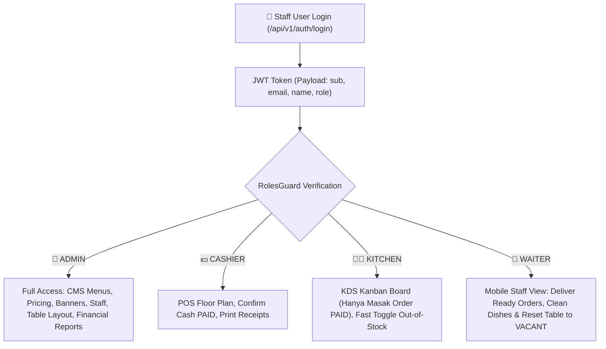
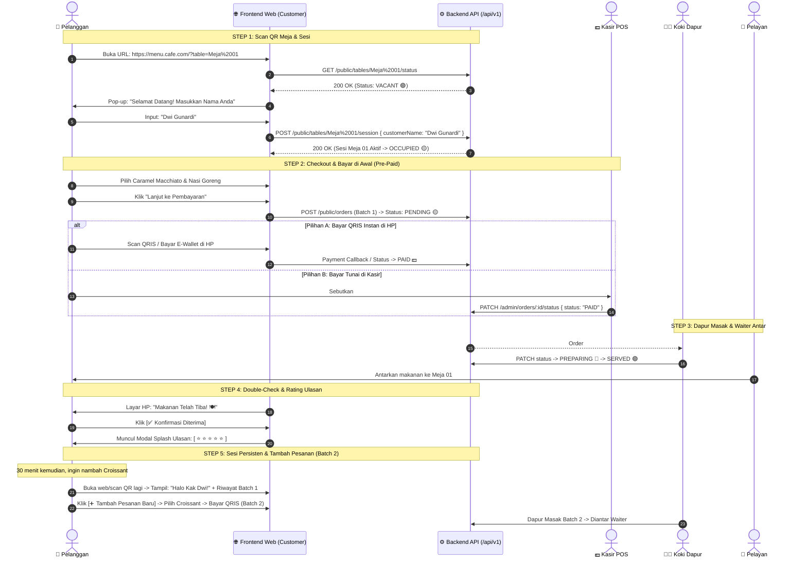
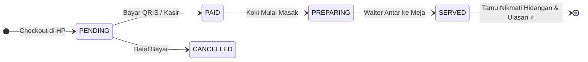
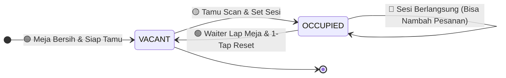

# 📱 MenuScan – Master Frontend Integration & Application Architecture Guide

> **Target Audience**: Frontend Engineers (React, Next.js, Vue, Flutter, Web / PWA), UI/UX Designers, Product Managers  
> **Backend Architecture**: NestJS 11 + PostgreSQL + Prisma ORM + ECDH / AES-256-GCM + Role-Based Access Control (RBAC)  
> **Ordering Model**: **Pre-Paid (Bayar di Awal / Pay-at-Order) + Persistent Multi-Batch Session**  
> **API Base URL**: `http://localhost:5000/api/v1`  
> **Interactive Swagger OpenAPI**: `http://localhost:5000/api/docs`  
> **Status**: **Production Ready & Complete (Phases 0–4 Verified)**

---

## 📑 Daftar Isi
1. [Executive Summary & Pre-Paid Model Concept](#1-executive-summary--pre-paid-model-concept)
2. [Arsitektur RBAC & 4 Peran Staff (Role-Based Access Control)](#2-arsitektur-rbac--4-peran-staff-role-based-access-control)
3. [Alur Bisnis & User Journey Terpadu (Pre-Paid Flow)](#3-alur-bisnis--user-journey-terpadu-pre-paid-flow)
   - [A. Customer Journey (Scan Meja $\rightarrow$ Pre-Paid $\rightarrow$ Rating $\rightarrow$ Tambah Pesanan)](#a-customer-journey-scan-meja--pre-paid--rating--tambah-pesanan)
   - [B. Kitchen KDS Journey (Hanya Masak Pesanan yang Sudah LUNAS / PAID)](#b-kitchen-kds-journey-hanya-masak-pesanan-yang-sudah-lunas--paid)
   - [C. Cashier POS Journey (Konfirmasi Bayar Cash / EDC)](#c-cashier-pos-journey-konfirmasi-bayar-cash--edc)
   - [D. Waiter Mobile Journey (Pengantaran Makanan & 1-Tap Reset Meja)](#d-waiter-mobile-journey-pengantaran-makanan--1-tap-reset-meja)
4. [Pemetaan Layar Frontend (Screen-by-Screen UI Blueprints)](#4-pemetaan-layar-frontend-screen-by-screen-ui-blueprints)
   - [A. Customer Mobile Web App (Screens 1 – 6)](#a-customer-mobile-web-app-screens-1--6)
   - [B. Proper Admin & Staff Dashboard Suite (Screens A – E)](#b-proper-admin--staff-dashboard-suite-screens-a--e)
5. [Spesifikasi Teknis Integrasi API](#5-spesifikasi-teknis-integrasi-api)
   - [A. Standard Envelope Response Format](#a-standard-envelope-response-format)
   - [B. Sesi Meja Persisten & Struktur Active Orders](#b-sesi-meja-persisten--struktur-active-orders)
   - [C. Logika Perhitungan Harga Varian di Frontend (Cart Formula)](#c-logika-perhitungan-harga-varian-di-frontend-cart-formula)
   - [D. State Machine Siklus Hidup Pesanan & Meja](#d-state-machine-siklus-hidup-pesanan--meja)
6. [Katalog Endpoint & Contoh Payload Lengkap](#6-katalog-endpoint--contoh-payload-lengkap)
   - [1. Default Credentials untuk Testing 4 Role Staff](#1-default-credentials-untuk-testing-4-role-staff)
   - [2. Modul Public (Customer)](#2-modul-public-customer)
   - [3. Modul Auth & Staff Profile](#3-modul-auth--staff-profile)
   - [4. Modul Admin & Staff Operations (KDS, Floor Plan, Menu)](#4-modul-admin--staff-operations-kds-floor-plan-menu)
   - [5. Modul Executive Dashboard Overview & Financial Reports](#5-modul-executive-dashboard-overview--financial-reports)

---

## 1. Executive Summary & Pre-Paid Model Concept

**MenuScan** mengadopsi model **Pre-Paid (Bayar di Awal)** yang umum digunakan pada cafe modern (*Starbucks, Fore, Kopi Kenangan*):

1. **Anti-Dine & Dash & Dapur Aman**: Dapur dan barista **hanya memasak pesanan yang sudah berstatus LUNAS (`PAID`)**.
2. **Pilihan Pembayaran Fleksibel**:
   - **Bayar Online Instan di HP**: Scan QRIS dinamis / E-Wallet / mBanking $\rightarrow$ Order langsung `PAID` dan masuk antrean dapur.
   - **Bayar di Kasir**: Tamu membawa nomor order ke kasir $\rightarrow$ Bayar tunai/debit $\rightarrow$ Kasir konfirmasi `PAID` $\rightarrow$ Order masuk antrean dapur.
3. **Sesi Meja Persisten (Multi-Batch Order)**: Tamu yang sedang nongkrong bisa scan ulang meja kapan saja untuk melihat riwayat pesanan (Batch 1, Batch 2) dan menambah pesanan baru tanpa perlu menginput nama ulang.
4. **Zero Burden on Customer Exit (Opsi A)**: Tamu tidak dibebani tombol kosongkan meja. Saat tamu selesai dan pulang, Waiter yang melihat meja kosong akan membersihkan piring/gelas kotor dan melakukan 1-tap reset meja kembali menjadi `VACANT`.

---

## 2. Arsitektur RBAC & 4 Peran Staff (Role-Based Access Control)

Backend MenuScan diamankan dengan **Guards RBAC Global (`RolesGuard`)** yang memeriksa hak akses token JWT pada setiap endpoint:



### 📋 Matriks Hak Akses Peran Staff

| Fitur / Endpoint | `ADMIN` | `CASHIER` | `KITCHEN` | `WAITER` | Catatan Keamanan |
| :--- | :---: | :---: | :---: | :---: | :--- |
| **Laporan Omset & Dashboard KPI** (`/admin/reports/*`) | ✅ | ❌ | ❌ | ❌ | Data rahasia omset cafe |
| **CMS Banners & Kategori** (`/admin/banners`, `/categories`) | ✅ | ❌ | ❌ | ❌ | Hak manajemen marketing |
| **CRUD Menu & Atur Harga** (`POST/PATCH/DELETE /admin/menus`) | ✅ | ❌ | ❌ | ❌ | Hak kontrol harga produk |
| **Fast Toggle Stok Habis** (`PATCH /admin/menus/:id/status`) | ✅ | ✅ | ✅ | ❌ | Dapur bisa langsung matikan menu yang habis |
| **Live Order Monitor** (`GET /admin/orders`) | ✅ | ✅ | ✅ | ✅ | Visibilitas operasional bersama |
| **Status Order $\rightarrow$ PREPARING / SERVED** | ✅ | ❌ | ✅ | ✅ | Koki memasak, Waiter mengantar |
| **Status Order $\rightarrow$ PAID (Cashier Confirmation)** | ✅ | ✅ | ❌ | ❌ | Kasir konfirmasi bayar tunai |
| **Floor Plan Meja** (`GET /admin/tables`) | ✅ | ✅ | ❌ | ✅ | Monitoring keterisian meja |
| **Reset Meja ke VACANT** (`POST /admin/tables/:id/reset`) | ✅ | ✅ | ❌ | ✅ | Waiter bersihkan meja & set siap pakai |

---

## 3. Alur Bisnis & User Journey Terpadu (Pre-Paid Flow)

### A. Customer Journey (Scan Meja $\rightarrow$ Pre-Paid $\rightarrow$ Rating $\rightarrow$ Tambah Pesanan)



---

## 4. Pemetaan Layar Frontend (Screen-by-Screen UI Blueprints)

### A. Customer Mobile Web App (Screens 1 – 6)

```
┌────────────────────────────────────────────────────────────────────────────────────────┐
│                                CUSTOMER MOBILE WEB APP                                 │
├──────────────────────────┬──────────────────────────┬──────────────────────────────────┤
│ Screen 1: Scan & Nama    │ Screen 2: Catalog Home   │ Screen 3: Detail Menu & Varian   │
├──────────────────────────┼──────────────────────────┼──────────────────────────────────┤
│ 🍽️ Cafe Logo            │ 🏷️ [Banner Carousel]    │ 🖼️ [Gambar Menu Besar]          │
│                          │ 🔘 [All][Kopi][Snack]... │ ☕ Caramel Macchiato             │
│ 📍 Meja Terdeteksi:      │ 🔍 [Cari Menu...]        │ 💵 Rp 30.000 (Promo)             │
│   "Meja 01"              │ ┌──────────────────────┐ │ 🔘 Pilih Ukuran (Wajib):         │
│ 👤 Nama Anda:            │ │ ☕ Caramel Macchiato │ │    (o) Regular  ( ) Large (+6k)  │
│ [ Dwi Gunardi          ] │ │ Rp 30.000  [+ Tambah]│ │ 🔘 Suhu (Wajib):                 │
│ [ 🚀 Mulai Pesan Menu ]  │ └──────────────────────┘ │    (o) Hot  ( ) Iced (+2k)       │
│                          │ 🛒 [Keranjang: 2 Items]  │ [ + Masukkan Keranjang (36k) ]   │
├──────────────────────────┼──────────────────────────┼──────────────────────────────────┤
│ Screen 4: Pembayaran HP  │ Screen 5: Live Tracking  │ Screen 6: Persistent Session     │
├──────────────────────────┼──────────────────────────┼──────────────────────────────────┤
│ 💳 PILIH METODE BAYAR    │ 🧾 Status Pesanan #ORD-01│ 📍 MEJA 01 • SESI AKTIF (Dwi G)  │
│ ──────────────────────── │ 🟢 1. Lunas / PAID       │ ──────────────────────────────── │
│ 🔘 [📱 QRIS / E-Wallet ] │ 🟡 2. Sedang Dimasak     │ 📜 RIWAYAT PESANAN MEJA INI:     │
│    (GoPay, OVO, BCA, DANA│ 🍽️ 3. Makanan Tiba      │ • Batch 1: #ORD-001 (LUNAS/SERVED│
│                          │ [ ✅ Konfirmasi Diterima]│   1x Caramel Macchiato           │
│ 🔘 [💵 Bayar di Kasir ]  │ ──────────────────────── │   1x Nasi Goreng Spesial Cafe    │
│    (Tunjukkan #ORD-001)  │ 🌟 BAGAIMANA PESANAN?    │ ──────────────────────────────── │
│                          │ [ ⭐ ⭐ ⭐ ⭐ ⭐ ]       │ [ ➕ TAMBAH PESANAN KE MEJA 01 ] │
│ [ ⚡ Bayar Sekarang ]    │ [ Kirim Ulasan ]         │                                  │
└──────────────────────────┴──────────────────────────┴──────────────────────────────────┘
```

---

### B. Proper Admin & Staff Dashboard Suite (Screens A – E)

```
┌────────────────────────────────────────────────────────────────────────────────────────────────────────┐
│                                 PROPER CAFE ADMIN DASHBOARD SUITE                                      │
├────────────────────────────────────────────────────────────────────────────────────────────────────────┤
│ 1. 📊 Layar A: Executive Dashboard │ • 4 KPI Cards: Omset Hari Ini, Active Orders, Table Occupancy    │
│    (Role: ADMIN)                   │ • Recent Orders Table & Top Selling Products Today               │
├────────────────────────────────────┼──────────────────────────────────────────────────────────────────┤
│ 2. 🍳 Layar B: Kitchen Display KDS │ • Kanban 3 Kolom: [MASUK / PAID 🟡] ➔ [PREPARING 🔵] ➔ [SERVED 🟢] │
│    (Role: ADMIN, KITCHEN, WAITER)  │ • Dapur HANYA memasak pesanan yang sudah berstatus PAID          │
├────────────────────────────────────┼──────────────────────────────────────────────────────────────────┤
│ 3. 📍 Layar C: Floor Plan & Meja   │ • Grid visual meja: 🟢 VACANT | 🟡 OCCUPIED (Sedang Makan)       │
│    (Role: ADMIN, CASHIER, WAITER)  │ • Waiter 1-Tap Reset Meja ke VACANT saat tamu selesai            │
├────────────────────────────────────┼──────────────────────────────────────────────────────────────────┤
│ 4. 🍽️ Layar D: Menu Catalog CMS    │ • 1-Click Fast Toggle "Stok Habis / Ada" di tabel               │
│    (Role: ADMIN, Fast: KITCHEN)    │ • Drag & drop urutan kategori & Visual Variant Group Builder     │
├────────────────────────────────────┼──────────────────────────────────────────────────────────────────┤
│ 5. 📈 Layar E: Financial Reports   │ • Filter tanggal kustom, kalkulasi AOV & omset per kategori      │
│    (Role: ADMIN Only)              │ • Export laporan & grafik omset                                  │
└────────────────────────────────────┴──────────────────────────────────────────────────────────────────┘
```

---

## 5. Spesifikasi Teknis Integrasi API

### A. Standard Envelope Response Format

```json
{
  "success": true,
  "statusCode": 200,
  "data": { ... }
}
```

---

### B. Sesi Meja Persisten & Struktur Active Orders

Saat pelanggan scan QR meja (`GET /api/v1/public/tables/:number/status`), backend mengembalikan riwayat seluruh batch pesanan aktif di meja tersebut:

```json
{
  "success": true,
  "statusCode": 200,
  "data": {
    "tableId": "b1b0cb7e-7c5e-473d-8158-b80c2f342f0b",
    "number": "Meja 01",
    "status": "OCCUPIED",
    "activeCustomerName": "Dwi Gunardi",
    "activeOrderId": "ord-001",
    "activeOrderNumber": "ORD-20260810-001",
    "activeOrders": [
      {
        "id": "ord-001",
        "orderNumber": "ORD-20260810-001",
        "status": "SERVED",
        "totalAmount": 86000,
        "paidAt": "2026-08-10T10:17:00.000Z",
        "createdAt": "2026-08-10T10:15:00.000Z",
        "items": [
          {
            "name": "Caramel Macchiato",
            "quantity": 1,
            "subtotal": 44000,
            "selectedVariants": [
              { "groupName": "Pilih Ukuran", "optionName": "Large (16 oz)" },
              { "groupName": "Suhu Penyajian", "optionName": "Iced" },
              { "groupName": "Extra Add-ons", "optionName": "Extra Espresso Shot" }
            ]
          },
          {
            "name": "Nasi Goreng Spesial Cafe",
            "quantity": 1,
            "subtotal": 42000,
            "selectedVariants": [
              { "groupName": "Level Kepedasan", "optionName": "Pedas Mantap (Level 2)" },
              { "groupName": "Pilihan Telur", "optionName": "Telur Dadar Gurih" }
            ]
          }
        ]
      }
    ]
  }
}
```

---

### C. Logika Perhitungan Harga Varian di Frontend (Cart Formula)

$$\text{Item Unit Price} = \text{Effective Menu Price} + \sum (\text{Extra Price of Selected Options})$$

$$\text{Item Subtotal} = \text{Item Unit Price} \times \text{Quantity}$$

---

### D. State Machine Siklus Hidup Pesanan & Meja

#### 1. Siklus Pesanan (Order Lifecycle - Pre-Paid)


#### 2. Siklus Meja (Table Lifecycle)


---

## 6. Katalog Endpoint & Contoh Payload Lengkap

### 1. Default Credentials untuk Testing 4 Role Staff

| Role Staff | Email Login | Password | Akses Halaman |
| :--- | :--- | :--- | :--- |
| 👑 **ADMIN** | `admin@menuscan.com` | `admin123` | Semua Layar (Executive Overview, CMS Menu, Banner, Meja, Laporan) |
| 💵 **CASHIER** | `cashier@menuscan.com` | `cashier123` | Layar POS Floor Plan, Konfirmasi Bayar Cash (`PAID`), Fast Toggle Stok |
| 👨‍🍳 **KITCHEN** | `kitchen@menuscan.com` | `kitchen123` | Layar KDS Kanban Dapur (`PREPARING` $\rightarrow$ `SERVED`), Fast Toggle Stok |
| 🤵 **WAITER** | `waiter@menuscan.com` | `waiter123` | Layar Mobile Waiter (Antar `SERVED` & Reset Meja `VACANT`) |

---

### 2. Modul Public (Customer)

- **Cek Status Meja & Riwayat Sesi**: `GET /api/v1/public/tables/:number/status`
- **Inisialisasi Sesi**: `POST /api/v1/public/tables/:number/session` (`{ "customerName": "Dwi Gunardi" }`)
- **Banners Promo**: `GET /api/v1/public/banners`
- **Kategori Menu**: `GET /api/v1/public/categories`
- **Katalog Menu**: `GET /api/v1/public/menus?categoryId=...`
- **Detail Menu & Varian**: `GET /api/v1/public/menus/:id`
- **Buat Pesanan Baru (Batch 1 / Batch 2)**: `POST /api/v1/public/orders`
- **Live Tracking Pesanan**: `GET /api/v1/public/orders/:orderNumber`

---

### 3. Modul Auth & Staff Profile

- **Login Staff**: `POST /api/v1/auth/login`
- **Cek Profile**: `GET /api/v1/auth/me` (Header: `Authorization: Bearer <token>`)

---

### 4. Modul Admin & Staff Operations (KDS, Floor Plan, Menu)

*(Wajib Header: `Authorization: Bearer <accessToken>`)*

#### 4.1. Kitchen Display System (KDS)
- **List Pesanan Masuk Lunas**: `GET /api/v1/admin/orders?status=PAID&page=1&limit=20` *(Akses: ADMIN, KITCHEN, CASHIER, WAITER)*
- **Update Status Masak / Saji**: `PATCH /api/v1/admin/orders/:id/status` (`{ "status": "PREPARING" | "SERVED" }`)

#### 4.2. Floor Plan & 1-Tap Reset Meja
- **List Semua Meja**: `GET /api/v1/admin/tables` *(Akses: ADMIN, CASHIER, WAITER)*
- **Reset Meja Setelah Tamu Pulang & Dibersihkan**: `POST /api/v1/admin/tables/:id/reset` *(Akses: ADMIN, CASHIER, WAITER)*

#### 4.3. Fast Toggle Stok Menu
- **Fast Toggle Stok Habis (1-Click)**: `PATCH /api/v1/admin/menus/:id/status` (`{ "isAvailable": false }`)

---

### 5. Modul Executive Dashboard Overview & Financial Reports

*(Akses Eksklusif: Role `ADMIN`)*

- **Consolidated Dashboard Overview**: `GET /api/v1/admin/reports/dashboard-overview`
- **Laporan Omset Berdasarkan Periode**: `GET /api/v1/admin/reports/revenue?startDate=2026-08-01&endDate=2026-08-10`
- **Top Selling Products**: `GET /api/v1/admin/reports/top-selling?limit=5`
