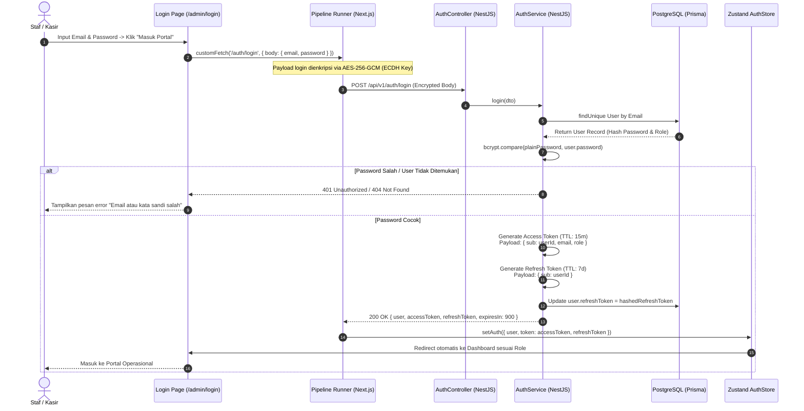
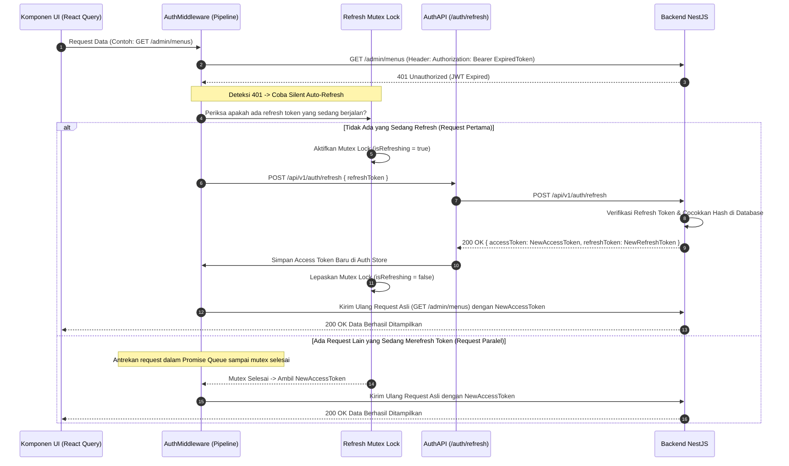
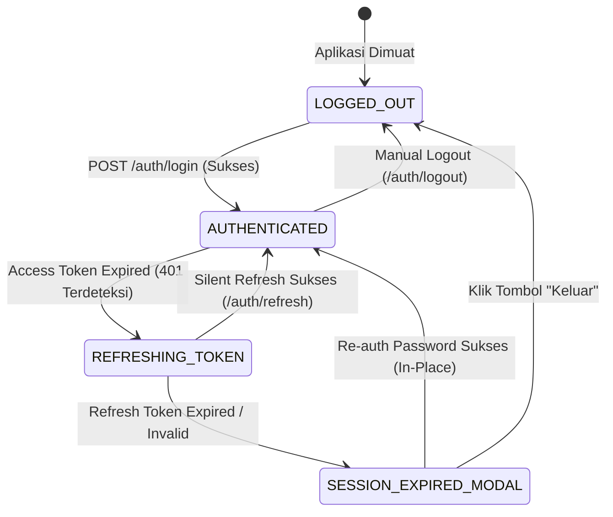

# 🔑 Panduan Lengkap: Autentikasi Staf, Manajemen Access & Refresh Token, serta Penanganan Sesi Habis

> **Dokumen Spesifikasi Teknis & Logika Bisnis**  
> **Sistem**: MenuScan Staff Portal & Order Management  
> **Lingkup**: Frontend (Next.js 15, Zustand, React Query) & Backend (NestJS 11, Passport JWT, Prisma ORM, Redis)  
> **Tujuan**: Menjelaskan seluruh alur login, siklus hidup dual-token JWT, silent auto-refresh, serta modal pemulihan sesi kedaluwarsa tanpa kehilangan data kerja.

---

## 📑 Daftar Isi
1. [Prinsip Desain & Arsitektur Keamanan](#1-prinsip-desain--arsitektur-keamanan)
2. [Alur Login Staf (Initial Authentication)](#2-alur-login-staf-initial-authentication)
3. [Siklus Hidup & Mekanika Dual-Token (Access Token & Refresh Token)](#3-siklus-hidup--mekanika-dual-token-access-token--refresh-token)
4. [Mekanisme Silent Auto-Refresh & Mutex Lock](#4-mekanisme-silent-auto-refresh--mutex-lock)
5. [Penanganan Sesi Habis Total via SessionExpiredModal](#5-penanganan-sesi-habis-total-via-sessionexpiredmodal)
6. [Alur Logout & Pencabutan Sesi](#6-alur-logout--pencabutan-sesi)
7. [Diagram Alur & State Machine (Mermaid)](#7-diagram-alur--state-machine-mermaid)
8. [Daftar File & Referensi Kode Terkait](#8-daftar-file--referensi-kode-terkait)

---

## 1. Prinsip Desain & Arsitektur Keamanan

Sistem autentikasi staf dirancang dengan 3 pilar utama:
1. **Short-Lived Access Tokens (15 Menit)**: Mengurangi risiko jika Access Token terekspos karena masa berlakunya sangat singkat.
2. **Secure Refresh Mechanism (7 Hari)**: Menggunakan Refresh Token yang disimpan secara aman untuk memperbarui Access Token di latar belakang (*silent refresh*) tanpa mengganggu pekerjaan kasir/staf.
3. **Zero Data Loss on Expiry (In-Place Re-auth)**: Jika sesi staf habis total, aplikasi **TIDAK melakukan redirect paksa ke halaman login**, melainkan menampilkan popup modal re-login di tempat sehingga data formulir pesanan/menu yang sedang diketik tidak hilang.

---

## 2. Alur Login Staf (Initial Authentication)



---

## 3. Siklus Hidup & Mekanika Dual-Token (Access Token & Refresh Token)

| Parameter | Access Token | Refresh Token |
| :--- | :--- | :--- |
| **Masa Berlaku (TTL)** | **15 Menit** | **7 Hari** |
| **Format Token** | JSON Web Token (JWT) | JSON Web Token (JWT) |
| **Payload Claims** | `{ sub, email, role, exp, iat }` | `{ sub, exp, iat }` |
| **Penyimpanan Frontend** | Memory Store (Zustand) + LocalStorage Sync | Encrypted LocalStorage / Secure Cookie |
| **Penyimpanan Backend** | Stateless (Diverifikasi via JWT Secret) | Hashed di database `User.refreshToken` / Redis |
| **Fungsi Utama** | Digunakan pada setiap request API ke `/admin/*` via header `Authorization: Bearer <token>`. | Digunakan khusus untuk meminta Access Token baru ke endpoint `POST /auth/refresh`. |

---

## 4. Mekanisme Silent Auto-Refresh & Mutex Lock

Ketika Access Token kedaluwarsa (berumur lebih dari 15 menit), backend akan menolak request dengan status `401 Unauthorized`. Frontend secara cerdas menangani kondisi ini di level **`authMiddleware`**:



### Keunggulan Mutex Lock:
Jika sebuah halaman dashboard memuat 5 query sekaligus (misal: orders, stats, menus, tables, notifications) saat token habis, **hanya 1 request refresh yang dikirim ke backend**. 4 query lainnya menunggu dan menggunakan token baru yang sama, mencegah masalah *Race Condition* atau *Refresh Token Storm*.

---

## 5. Penanganan Sesi Habis Total via `SessionExpiredModal`

Jika Refresh Token juga sudah habis masa berlakunya (misal staf tidak membuka aplikasi selama lebih dari 7 hari) atau akun dinonaktifkan:

1. Request `POST /api/v1/auth/refresh` mengembalikan status `401 / 403`.
2. Frontend mendeteksi kegagalan refresh total.
3. Alih-alih melakukan `window.location.href = '/admin/login'` (yang menghapus form/data yang belum disimpan), frontend memicu event `AUTH_SESSION_EXPIRED`.
4. Komponen **SessionExpiredModal** muncul di layar:
   - Menampilkan avatar dan nama staf yang sedang aktif.
   - Meminta staf memasukkan password akunnya kembali.
   - Setelah password valid dikirim ke backend, token diperbarui di background dan modal tertutup.
   - Request yang tertunda dilanjutkan tanpa merestart halaman atau kehilangan state form.

```
┌────────────────────────────────────────────────────────┐
│ 🔒 Sesi Anda Telah Berakhir                            │
│                                                        │
│ Sesi login Anda telah habis demi keamanan. Masukkan    │
│ kata sandi untuk melanjutkan tanpa kehilangan data.    │
│                                                        │
│ Pengguna: Budi Santoso (admin@menuscan.com)            │
│ Role:     ADMIN                                        │
│                                                        │
│ Kata Sandi: [ •••••••••••• ]                           │
│                                                        │
│ [ Keluar Akun ]                    [ Lanjutkan Sesi ]  │
└────────────────────────────────────────────────────────┘
```

---

## 6. Alur Logout & Pencabutan Sesi

Ketika staf menekan tombol "Keluar" di header:
1. Frontend memanggil `POST /api/v1/auth/logout` membawa `accessToken` dan `refreshToken`.
2. Backend menghapus `refreshToken` di database (`User.refreshToken = null`) dan membersihkan session key di Redis.
3. Frontend mengosongkan state `useAuthStore` dan menghapus data sesi di local storage.
4. Pengguna dialihkan ke halaman login `/admin/login`.

---

## 7. Diagram Alur & State Machine (Mermaid)

### State Machine Siklus Hidup Token Staf:



---

## 8. Daftar File & Referensi Kode Terkait

### Frontend (`fe-menu-scan-latihan`)
- `src/store/use-auth-store.ts`: State store Zustand untuk menyimpan user profile, access token, dan status login.
- `src/lib/api/pipeline/auth-middleware.ts`: Middleware penyisip Bearer token dan pengelola silent auto-refresh dengan queue lock.
- `src/components/admin/session-expired-modal.tsx`: Komponen modal re-login in-place.
- `src/components/admin/auth-guard.tsx`: Pelindung rute frontend berdasarkan autentikasi dan role.

### Backend (`be-menu-scan-latihan`)
- `src/modules/auth/auth.controller.ts`: Endpoint `/auth/login`, `/auth/refresh`, `/auth/logout`, dan `/auth/me`.
- `src/modules/auth/auth.service.ts`: Logika pembuatan JWT token, hash bcrypt, validasi refresh token.
- `src/common/guards/jwt-auth.guard.ts`: Passport JWT Guard untuk validasi header `Authorization: Bearer`.
- `src/common/guards/roles.guard.ts`: RBAC Guard untuk validasi dekorator `@Roles()`.
